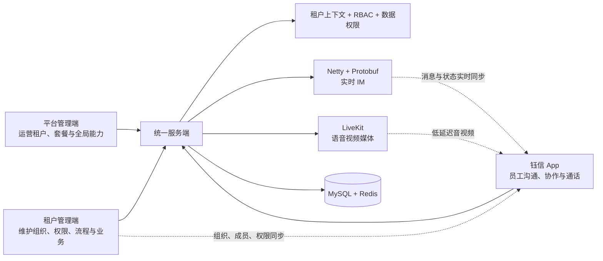
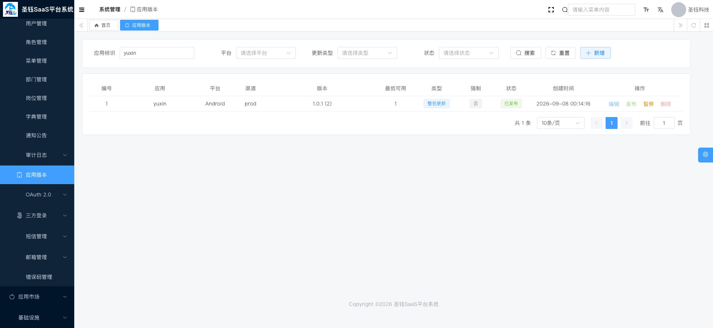

<p align="center">
 
 
 
 
 <a href="LICENSE"></a>
</p>

<h1 align="center">圣钰 SaaS Pro - 企业级多租户管理系统</h1>

<p align="center">
  <b>基于 Spring Boot + Vue 3 + Flutter 的多租户企业管理与协同通讯平台</b>
</p>

如果这个项目让你有所收获，记得 Star 关注哦，这对我是非常不错的鼓励与支持。

---

## 📖 项目简介

圣钰 SaaS Pro 是一个功能完善的企业级多租户管理系统，基于芋道开源系统进行深度定制开发（已获作者授权）。系统采用前后端分离架构，支持平台端和租户端双端管理，内置完整的权限管理、工作流引擎、即时通讯等企业级功能。

本仓库现已形成“**平台运营 + 租户经营 + 钰信移动通讯 + 统一服务端**”的一体化产品形态：平台管理员负责租户、套餐与全局能力运营；各租户在独立控制台完成组织、权限和业务配置；员工通过新开发的 **钰信** 企业级通讯 App 完成联系人协作、即时消息与音视频通话；后端为各端提供统一鉴权、业务 API、实时通信与基础设施支撑。

| 端 | 工程路径 | 面向角色 | 核心职责 |
| --- | --- | --- | --- |
| 平台管理端 | `shengyu-ui/shengyu-ui-platform-vue3` | 平台运营人员 | 租户与套餐、平台用户及全局配置、审计与基础设施运营 |
| 租户管理端 | `shengyu-ui/shengyu-ui-admin-vue3` | 租户管理员、业务人员 | 组织与成员、角色与数据权限、流程、插件及租户内业务管理 |
| 钰信企业通讯 App | `shengyu-ui/shengyu-ui-admin-flutter` | 企业员工、团队协作成员 | 通讯录、会话、群组、文件、消息、通知、语音/视频通话与个人工作台 |
| 服务端 | `shengyu-server` + `shengyu-module-*` | 上述所有客户端 | 多租户业务、认证授权、IM/通话信令、流程、基础设施与开放接口 |

### 核心特性

- 🎯 **多租户架构**：完善的租户隔离机制，支持租户独立配置
- 🔐 **权限管理**：基于 RBAC 的细粒度权限控制，支持数据权限
- 📱 **一体化多端体验**：Vue 3 平台端、Vue 3 租户端与钰信 Flutter 企业通讯 App 共享同一业务与权限体系
- 💬 **即时通讯**：基于 Netty + Protobuf 的高性能 IM 系统
- 🔄 **工作流引擎**：集成 FlowLong 工作流，支持可视化流程设计
- 🔌 **插件市场**：灵活的插件体系架构，支持功能扩展
- 🎨 **低代码支持**：表单设计器、代码生成器、报表设计器

### 产品亮点

- **一套身份与权限体系覆盖四端**：平台与租户分域管理，服务端统一认证授权；角色、菜单和数据权限共同约束 Web 管理端与移动端业务访问。
- **从企业管理延伸到即时协作**：钰信不只是消息入口，还将组织通讯录、群管理、群文件、消息搜索、收藏、已读回执、设备与通知能力纳入同一协作体验。
- **实时通信与业务系统同租户隔离**：IM 基于 Netty + Protobuf，业务侧提供会话、消息、群组、设备、推送、审计等接口；音视频通话使用 LiveKit 媒体服务，避免把媒体转发压力堆积在业务应用上。
- **可运营、可审计、可扩展**：登录/操作/API 访问与错误日志、敏感词、消息审计、短信邮件、文件服务、代码生成、定时任务、插件和流程能力均已模块化沉淀。
- **开发与交付路径完整**：支持本地前后端联调、Docker Compose 基础环境部署，以及 LiveKit 私有化部署与网络自检脚本，方便从研发环境走向客户环境。

### 为什么选择圣钰 SaaS Pro

| 关注点 | 项目提供的价值 |
| --- | --- |
| 希望快速交付 SaaS 产品 | 已具备平台运营、租户经营、权限、流程、基础设施和日志治理等通用底座，避免从账号、租户隔离和后台管理重复起步。 |
| 希望把“管理”与“协作”打通 | 租户端维护的部门、岗位、成员和权限直接成为钰信通讯录与协作边界，组织数据不需要在另一套 IM 系统中重复维护。 |
| 希望拥有自己的企业通讯能力 | 钰信覆盖会话、群组、文件、搜索、回执、通知和音视频通话；实时 IM 与 LiveKit 媒体服务均支持自有环境部署。 |
| 需要支持二次开发或采购交付 | 前后端按业务模块拆分，平台端、租户端和 App 的职责明确；插件、流程、代码生成、开放接口与部署文档降低持续扩展成本。 |
| 关注可管控与可追溯 | 多租户隔离、RBAC/数据权限、登录与操作审计、API 错误日志、敏感词、消息审计与文件治理共同构成企业级基础控制面。 |

## 🎯 系统架构


### 端到端运行关系

```text
平台管理端 Vue 3 ─┐
租户管理端 Vue 3 ─┼─ HTTPS / OAuth2 ─> shengyu-server（统一入口与应用启动）
钰信 Flutter App ─┤                         ├─ system：租户、组织、权限、流程、IM 业务
                  │                         ├─ platform：平台运营、租户套餐与全局配置
                  │                         ├─ infra：文件、代码生成、任务、配置、监控日志
                  │                         └─ framework：安全、数据权限、缓存、WebSocket 等通用能力
                  └─ Netty WebSocket / Protobuf ─> 实时 IM 通道

MySQL 8（业务数据）  Redis（缓存/会话等）  LiveKit（语音视频媒体与 TURN）
```

> 说明：业务 API、实时 IM 通道与媒体通话服务职责分离。LiveKit 仅承载实时音视频媒体能力；鉴权、呼叫状态、消息记录等仍由项目服务端统一管理。

### 一体化协同架构亮点



这张关系图表达的是项目区别于“后台系统外挂聊天工具”的核心：**管理侧建立可信组织与权限，钰信直接消费这些业务边界，服务端再把消息、通话、审计和数据治理统一在同一个租户域内**。对客户而言，既能用管理端运营企业，也能让员工在同一账号体系内完成日常协作；对开发者而言，可以分别扩展业务模块、App 功能和实时通信能力，而无需破坏既有边界。

### 技术栈

**后端技术**
- Spring Boot 2.7.18
- MyBatis-Plus（ORM 框架）
- Spring Security + OAuth2（认证授权）
- Redis（缓存）
- MySQL 8.0（数据库）
- Netty（即时通讯）
- Protobuf（消息协议）
- FlowLong（工作流引擎）
- Quartz（定时任务）

**前端技术**
- Vue 3.5 + TypeScript
- Vite 5.1（构建工具）
- Element Plus 2.11（UI 组件库）
- Pinia（状态管理）
- Axios（HTTP 客户端）
- ECharts（数据可视化）
- BPMN.js（流程设计器）

**钰信企业通讯 App（Flutter）**
- Flutter（Android、iOS、Web 工程）+ Riverpod + GoRouter
- Dio、WebSocket Channel、Drift/SQLite 与安全存储（网络、实时连接、本地缓存与会话凭据）
- LiveKit + 音频会话/原生来电能力（单聊、群聊语音与视频通话）
- Firebase 消息与本地通知（设备推送与来电/消息提醒）
- ARB 国际化资源，当前包含中文、英文、日文、韩文语言资源

## 🚀 快速开始

### 环境要求

- JDK 8+
- Maven 3.6+
- MySQL 8.0+
- Redis 6.0+
- Node.js 16+
- pnpm 8.6+

### 本地开发

1. **克隆项目**
```bash
git clone https://gitee.com/jinzheyi/yubb-saas-pro.git
cd yubb-saas-pro
```

2. **初始化数据库**
```bash
# 导入数据库脚本
mysql -u root -p < sql/mysql/1.0/shengyu-saas.sql
```

3. **启动后端服务**
```bash
# 修改配置文件 shengyu-server/src/main/resources/application-local.yaml
# 配置数据库和 Redis 连接信息

# 编译并启动
mvn clean install
cd shengyu-server
mvn spring-boot:run
```

4. **启动前端项目**

租户端：
```bash
cd shengyu-ui/shengyu-ui-admin-vue3
pnpm install
pnpm front
```

平台端：
```bash
cd shengyu-ui/shengyu-ui-platform-vue3
pnpm install
pnpm front
```

5. **启动钰信 Flutter App**
```bash
cd shengyu-ui/shengyu-ui-admin-flutter
flutter pub get
flutter run

# 构建 Android 调试包（按需）
flutter build apk --debug
```

钰信除 HTTP API 外还需要访问 IM WebSocket（默认服务端端口 `9000`）。需要进行语音视频通话联调时，请先按 [`deploy/livekit/README.md`](deploy/livekit/README.md) 部署或启动 LiveKit；真机必须能路由访问 LiveKit 节点公布的地址，不能使用 Docker `172.x` bridge 地址。

### Docker 部署

```bash
# 使用 Docker Compose 一键启动
docker-compose up -d
```

访问地址：
- 租户端：http://localhost:8080
- 平台端：http://localhost:8081
- 后端接口：http://localhost:48080
- IM WebSocket：`ws://localhost:9000`（容器端口可通过 `IM_WEBSOCKET_HOST_PORT` 调整）

### 部署说明

- 根目录 `docker-compose.yml` 编排 MySQL、Redis、kkFileView、后端、租户端 Vue 与平台端 Vue；环境变量可覆盖数据库、缓存、端口及前端 API 地址。
- `deploy/livekit/` 提供独立的 LiveKit Compose、局域网启动脚本与网络校验脚本。生产环境需要配置独立密钥、DNS/TLS/WSS、RTC/TURN 端口及客户端可路由的节点地址。
- `deploy/local-docker/` 提供本地 Docker 环境相关说明与配置。请将开发密钥、示例账号和本地网络配置与生产配置严格隔离。

## 🌐 在线体验

### 官网地址
[http://shengyukj.top/](http://shengyukj.top/)

官网提供完整的系统文档和使用指南

### 钰信 Android 安装体验

- 正式签名安装包：[下载钰信 Android v1.0.2（构建号 3）](https://shengyukj.top/download/yuxin-android-v1.0.2-build3.apk)
- 首次安装：使用 Android 手机浏览器下载后，按系统提示允许该浏览器安装应用，再完成安装。已安装旧版钰信的用户可直接覆盖安装，无需卸载。
- 后续更新：在钰信中进入“设置 -> 关于钰信 -> 检查更新”。应用会从平台版本服务获取更新提示并完成校验下载；无需每次连接电脑安装。
- iOS：暂不提供可公开下载安装的 IPA。iOS 必须由 Apple Distribution 签名并通过 TestFlight、App Store、MDM 或企业分发授权，未接入这些合规渠道前不提供无法正常安装的包。
- 鸿蒙：暂不提供安装包。当前客户端工程尚未接入鸿蒙原生工程、华为签名与分发链路；接入完成后将按 `.hap`/`.app` 的正式渠道发布。

安装包大小和 SHA-256 校验值以官网[快速体验](https://shengyukj.top/guide/explain/experience.html)页面展示的当前发布记录为准。

### 演示环境

**平台端**
- 地址：[http://saasadmin.shengyukj.top](http://saasadmin.shengyukj.top)
- 账号：test / 123456

**租户端**
- 地址：[http://saas.shengyukj.top](http://saas.shengyukj.top)
- 账号：jin_zheyicn@qq.com / shengyukj578503

## 📋 功能模块

### 平台端功能

- **租户管理**：租户创建、配置、套餐管理
- **用户管理**：平台用户管理、权限分配
- **系统配置**：字典管理、参数配置、菜单管理
- **基础设施**：文件管理、代码生成、接口文档、系统监控
- **日志中心**：操作日志、登录日志、访问日志、错误日志
- **消息管理**：短信管理、邮件管理、站内信

平台端还覆盖平台级角色/菜单与数据字典、OAuth2 客户端与令牌、验证码、社交账号、公告、插件应用与订单等运营能力；通过登录日志、操作日志、API 访问日志和错误日志形成可追溯的管理闭环。

### 租户端功能

- **组织架构**：部门管理、岗位管理、用户管理
- **权限管理**：角色管理、菜单管理、数据权限
- **工作流**：流程设计、流程分类、表单设计、任务管理
- **即时通讯**：单聊、群聊、消息推送（支持 50w+ 并发连接）
- **插件市场**：插件浏览、安装、配置
- **业务功能**：根据租户需求定制

租户端提供租户内的通知消息、敏感词与 IM 审计能力，并可围绕表单、流程、插件和业务模块持续扩展；租户配置与数据权限由服务端在请求链路中统一约束。

### 钰信企业级通讯 App（Flutter）

钰信是本仓库当前移动协作入口，对接同一套租户、组织、权限与 IM 服务。它不是独立的聊天壳，而是把企业的组织关系、权限边界、管理侧配置和员工协作体验真正连接起来：平台可运营租户和套餐，租户管理员可维护组织与业务，员工无需重复注册即可在钰信中进入通讯、文件协作和音视频通话。

对于希望私有化部署或采购交付的团队，钰信可作为企业门户中的高频协作入口；对于二次开发者，Flutter 端的联系人、会话、通话、通知、文件与工作台能力按特性划分，能够在不改动平台/租户管理端的前提下持续演进移动体验。

| 能力域 | 已覆盖能力 |
| --- | --- |
| 账号与工作空间 | 登录、验证码辅助、会话保持、租户切换、个人资料与设备管理 |
| 组织与联系人 | 企业通讯录、组织成员查询、联系人详情、群组创建/成员与群设置管理 |
| 会话与消息 | 单聊、群聊、会话未读与角标、置顶/免打扰、历史消息加载与搜索、回复/转发/@ 提及/收藏、已读回执 |
| 富媒体协作 | 文本、图片、语音、视频、文件、位置、名片、表情等消息；群文件与文件预览能力 |
| 通话 | 单聊及群聊语音/视频呼叫，来电通知与原生来电界面适配，呼叫状态由服务端统一记录 |
| 可靠性体验 | 本地 SQLite 缓存、凭据安全存储、WebSocket 实时连接与重连、推送设备登记、前后台通知处理 |
| 国际化 | 基于 ARB 资源管理，包含中文、英文、日文、韩文资源；新增页面应复用本地化键，不写死展示文案 |

#### 钰信与管理端如何协同

1. **平台建立边界**：平台端创建租户、分配套餐和全局能力，保障不同企业之间的资源与数据隔离。
2. **租户沉淀组织**：租户端维护部门、岗位、成员、角色与数据权限，并配置流程、通知、插件等业务能力。
3. **钰信激活协作**：员工使用同一身份进入 App，基于租户组织获得联系人与群协作范围，使用消息、文件和语音/视频通话完成日常工作。
4. **服务端统一治理**：API 鉴权、实时消息、呼叫状态、文件、通知、审计与缓存统一由后端模块承接，避免管理后台和移动协作产生两套孤立数据。

这种设计使项目既可以作为完整的多租户企业平台交付，也可以在客户已有业务系统基础上，以模块化方式接入管理控制面和企业通讯能力。

> 音视频质量除客户端采集与回声消除等处理外，也强依赖网络、耳机/扬声器路由和部署侧 TURN/ICE 配置。请按 LiveKit 部署文档完成可路由地址、端口与 TLS 配置后再进行跨网络验收。

## 💬 钰信 App 功能全景

钰信面向企业员工的日常沟通与协作，工程位于 `shengyu-ui/shengyu-ui-admin-flutter`。它以 Flutter 构建 Android、iOS 与 Web 客户端，并通过同一套服务端接口、租户上下文和实时通信通道，融入圣钰 SaaS Pro 的管理体系。以下功能以当前 Flutter 与服务端实现为准。

### 1. 账号、租户与个人工作空间

- **统一登录与会话保持**：复用服务端认证能力；令牌使用安全存储管理，减少重复登录带来的使用中断。
- **多租户工作空间切换**：支持查看和切换可访问租户，让同一用户在授权范围内进入不同企业工作空间。
- **个人资料与设置**：支持查看与维护个人资料、头像、语言和主题等偏好；提供设备管理入口，便于识别当前终端。
- **工作台入口**：将个人常用能力和企业业务入口收敛到 App 内，后续可按租户业务继续扩展，而不必重建通讯基础能力。

### 2. 企业通讯录、组织与关系管理

- **组织化通讯录**：按部门浏览企业成员，支持成员详情、组织浏览和搜索，组织关系来源于租户管理侧而非额外维护一套通讯录。
- **常用关系管理**：支持星标联系人、我的关注、我的部门和我的群组等视图，降低大型组织中寻找协作对象的成本。
- **从人到会话的快速协作**：从联系人资料可直接发起单聊；群成员页面与成员选择器复用组织数据，适用于拉群、转发、@ 提及和通话邀请。
- **群加入治理**：支持群邀请链接/邀请码、入群申请、申请审批或拒绝、群公告等能力，使群协作兼顾便利性和成员边界控制。

### 3. 单聊、群聊与会话管理

- **单聊与群聊**：支持创建或进入会话、会话列表按类型筛选、会话搜索，以及服务端会话同步；适用于一对一沟通和团队协作。
- **会话效率**：支持未读数与应用角标、置顶、免打扰、已读状态、会话列表预览和最近消息状态，让高频会话优先呈现。
- **消息可靠状态**：消息在客户端区分发送中、已发送、已送达、已读、撤回和失败状态；网络恢复后可通过消息拉取、同步和本地缓存保持会话连续性。
- **历史与检索**：支持按会话加载历史消息、消息窗口定位、全局/会话内消息搜索与会话搜索，帮助团队回溯上下文。

### 4. 富媒体消息与内容协作

| 类型 | 适用场景与能力 |
| --- | --- |
| 文本与表情 | 日常沟通、表情和贴纸表达，并支持回复、转发、@ 提及等协作操作。 |
| 图片与视频 | 相册/拍摄素材发送、消息预览与视频在线播放，适用于现场信息同步。 |
| 语音 | 语音消息录制、发送和播放，适用于移动办公或不便输入的场景。 |
| 文件与群文件 | 文件发送、下载、文件预览与群文件归集，便于在聊天上下文中沉淀资料。 |
| 位置与名片 | 位置共享和联系人名片转发，便于现场协作和成员引荐。 |
| 系统与通话记录 | 群系统事件、通话结果等以消息形式留在会话中，便于理解协作上下文。 |

除消息发送外，钰信还支持消息收藏与收藏检索、消息转发、消息撤回配置和已读回执查询。富媒体内容、会话数据与文件服务由后端统一治理，避免客户端私自维护难以审计的数据通道。

### 5. 群组协作与管理能力

- **建群与成员生命周期**：支持创建群、编辑群资料、添加/移除成员、群内昵称、群设置与群公告管理。
- **群成员范围可控**：成员选择和邀请建立在企业通讯录之上；对于需要审批的场景，可使用申请、审批/拒绝和邀请码流程。
- **资料沉淀**：群文件与文件预览让项目资料、会议附件和交付文档留在对应协作空间；结合历史消息和搜索，减少信息散落在个人终端的问题。
- **适配团队协作场景**：群会话可承载 @ 提及、回复、转发、未读提醒和群通话，覆盖项目群、部门群、临时协同群等常见使用方式。

### 6. 企业级语音与视频通话

- **覆盖单聊和群聊**：可从会话发起语音或视频呼叫，并支持多人群组呼叫邀请。
- **完整呼叫状态**：服务端处理创建邀请、接听、拒接、取消、挂断、活动通话查询、状态同步和通话记录查询；客户端基于该状态展示通话结果，避免只依赖本地 UI 判断。
- **来电体验与前后台适配**：Flutter 端集成原生来电界面、来电铃声、屏幕常亮、音频会话与设备路由处理，并在前后台结合推送/本地通知提醒用户。
- **媒体与业务分层**：LiveKit 承担实时音视频、ICE/TURN 协商；项目服务端保留鉴权、成员校验、呼叫状态和审计记录。该分层有利于独立扩展媒体节点，也便于定位业务与网络问题。
- **私有化可控**：仓库提供 LiveKit 部署和网络校验说明；客户可在自身网络、域名、证书和密钥体系中部署媒体服务。

### 7. 通知、离线与数据可靠性

- **实时与离线双通道**：前台通过 WebSocket 获取实时事件，离线或后台场景通过推送设备登记、Firebase 消息和本地通知承接提醒。
- **通知路由**：通知事件可根据类型跳转至对应会话、来电或业务页面，减少用户从系统通知回到正确协作上下文的路径。
- **本地数据层**：使用 Drift/SQLite 缓存会话、消息和通话记录等数据，配合服务端同步、拉取与重连策略提升网络波动时的可用性。
- **安全与隔离**：认证凭据使用安全存储；数据访问经统一 API 和租户权限校验，实时 IM 也遵循同一租户边界。

### 8. 国际化与可持续二开

- **国际化资源体系**：采用 ARB 管理界面文案，当前包含中文、英文、日文、韩文资源；页面应使用本地化键，便于后续增加语言而非散落硬编码文本。
- **特性化工程组织**：联系人、IM 会话、聊天、通话、通知、设备、文件、搜索、登录、个人资料和工作台按特性拆分，适合团队并行开发与按模块交付。
- **与 SaaS 能力共同演进**：App 不绑定某一个单体业务页面。租户端新增的组织、流程、插件或业务能力可以在服务端权限与 API 边界内逐步接入 App，保持管理与协作的一致性。

> 钰信的定位是企业协同能力，而非孤立聊天应用。它与平台端、租户端、服务端共享租户、组织、身份和治理能力，因此可以作为开源项目的完整移动协作入口，也适合作为商业化交付中的企业通讯模块。

## 📁 项目结构

```
yubb-saas-pro/
├── shengyu-dependencies/          # 依赖版本管理
├── shengyu-framework/             # 框架核心组件
│   ├── shengyu-common/           # 通用工具类
│   ├── shengyu-spring-boot-starter-web/        # Web 核心配置
│   ├── shengyu-spring-boot-starter-security/   # 安全认证
│   ├── shengyu-spring-boot-starter-mybatis/    # 数据库持久层
│   ├── shengyu-spring-boot-starter-redis/      # Redis 缓存
│   ├── shengyu-spring-boot-starter-flowlong/   # 工作流引擎
│   └── ...                       # 其他组件
├── shengyu-module-system/         # 租户端业务模块
│   ├── shengyu-module-system-api/ # 对外 API
│   └── shengyu-module-system-biz/ # 业务实现
├── shengyu-module-platform/       # 平台端业务模块
│   ├── shengyu-module-platform-api/
│   └── shengyu-module-platform-biz/
├── shengyu-module-infra/          # 基础设施模块
│   ├── shengyu-module-infra-api/
│   └── shengyu-module-infra-biz/
├── shengyu-server/                # 服务启动模块
├── shengyu-ui/                    # 前端项目
│   ├── shengyu-ui-admin-vue3/    # 租户端前端
│   ├── shengyu-ui-platform-vue3/ # 平台端前端
│   └── shengyu-ui-admin-flutter/ # 钰信企业级通讯 App（Flutter）
├── deploy/                        # Docker、LiveKit 与本地部署配置
├── docker-compose.yml             # 基础服务与 Web 管理端编排
└── sql/                           # 数据库脚本
```

## 🎨 系统截图

### 平台运营与多端发布



平台端可统一维护钰信 Android、iOS、鸿蒙等不同平台与渠道的版本记录、最低可用构建、强制更新策略、发布状态、安装包信息及校验摘要。上图为已脱敏的线上运行界面截图，不包含客户、员工或会话数据。

### 钰信移动协作与音视频通话


钰信围绕企业通讯录提供会话、文件、消息状态和单聊/群聊语音视频通话。媒体传输由可私有化部署的 LiveKit 承担，呼叫状态、租户与权限校验、事件投递和审计仍由项目服务端控制；图片为无客户资料的产品场景展示。

更多历史后台功能界面可在 `shengyu-ui/shengyu-ui-platform-vue3/.image/` 目录查阅。该目录中包含上游基础功能的历史演示素材，商务展示应优先使用本节与官网中的当前品牌素材。

## 📊 版本说明

### 📓 登记开源版

适合希望体验项目架构、开展学习研究与自主二次开发的开发者。

获取方式：

- 在 Gitee/GitHub 平台为项目点赞
- 在登记平台进行使用登记（仅用于宣传，不会骚扰用户）

### 💎 商用 Pro 版

> **面向企业交付、项目采购与长期二开。** 商用 Pro 版以“多租户企业管理 + 钰信协同通讯 + 私有化实时音视频 + 可持续交付支持”为核心，帮助团队在统一的组织、权限、业务和协作体系上快速落地产品。

#### Pro 版核心特色

| 特色 | 为采购方与交付团队带来的价值 |
| --- | --- |
| 🏢 **四端一体化产品能力** | 同时覆盖平台运营端、租户管理端、钰信 Flutter App 和统一服务端；从租户运营、组织管理到员工协同不再需要拼装多套孤立系统。 |
| 💬 **钰信企业通讯与协作** | 交付企业通讯录、单聊/群聊、富媒体消息、群文件、搜索、回执、通知、设备管理和工作台等高频协作能力，并与租户组织和权限直接打通。 |
| 📞 **私有化音视频通话链路** | 基于 LiveKit 提供单聊/群聊语音视频、来电体验、通话状态与记录；媒体服务可部署在客户自己的网络、域名和证书体系中。 |
| 🔐 **企业级管理与治理底座** | 多租户隔离、RBAC/数据权限、操作与访问审计、错误日志、敏感词、消息审计、文件服务、短信邮件与通知能力可统一纳入企业治理。 |
| 🔄 **业务可持续扩展** | 工作流、表单、代码生成、插件市场、开放接口与模块化后端架构，让项目能够从基础后台持续演进为客户自己的业务平台。 |
| 🚀 **交付与实施友好** | 提供 Docker Compose 基础部署、LiveKit 私有化部署说明、网络校验路径，以及针对二次开发、升级和合理需求的协作支持。 |

#### 推荐采购场景

- 希望交付一套包含 **SaaS 运营后台、租户业务后台和员工移动协作 App** 的企业数字化产品。
- 希望将已有业务系统接入 **私有化 IM、企业通讯录、群协作和音视频通话**，并保留自主部署与二开能力。
- 希望减少从零建设多租户、权限、审计、流程和实时通信底座的周期，把研发资源投入行业业务本身。
- 希望获得可落地的工程结构、部署方案与后续升级/二开协作，而不仅仅是一份功能演示代码。

#### 版本与服务权益

| 权益项 | 登记开源版 | 商用 Pro 版 | 说明 |
| --- | :---: | :---: | --- |
| 平台端与租户端基础业务 | ✅ | ✅ | 平台运营与租户管理的基础能力 |
| 钰信企业通讯 App 与实时协作能力 | 以开源仓库当前发布内容为准 | ✅ | Pro 版面向完整交付、持续集成与实施支持 |
| 私有化 IM / 音视频部署方案 | 参考仓库文档 | ✅ | 支持结合客户网络、域名、证书与部署环境落地 |
| 商用授权 | ✅ | ✅ | 具体授权范围以双方约定为准 |
| 二开后申请软著 | ✅ | ✅ | 具体材料与流程请按实际项目确认 |
| 插件市场与租户切换 | ✅ | ✅ | 支持插件体系及钉钉/企业微信模式的动态切换 |
| 二次授权给客户 | ❌ | ✅ | 登记版仅限自用 |
| 官网新插件集成 | ❌ | ✅ | 按 Pro 版服务约定执行 |
| 合理需求定制支持 | ❌ | ✅ | 结合项目范围评估 |
| 二次开发问题协助 | ❌ | ✅ | 购买后半年内 |
| 版本升级协助 | ❌ | ✅ | 购买后半年内 |
| 专属技术交流群 | ❌ | ✅ | 便于交付期间协作沟通 |

#### 获取与咨询

商用 Pro 版通过付费购买获取。采购前建议明确目标部署方式（公有云/私有化）、预计租户数量、是否需要钰信 App、音视频通话网络条件及行业定制范围，以便制定更贴合实际的交付方案。

联系入口请见文末的官网、Gitee 与 GitHub 信息。

## 🔧 开发指南

### 后端开发规范

**包结构**
- 按功能模块组织代码，每个模块包含 `controller`、`service`、`mapper`、`dal` 等子包
- 业务逻辑在 `service` 层实现，`controller` 仅负责请求响应
- `mapper` 负责数据库操作，`dal` 定义实体类

**命名规范**
- 类名：大驼峰（如 `UserServiceImpl`）
- 方法名：小驼峰（如 `getUserById`）
- 表名/字段名：下划线命名（如 `user_info`, `create_time`）

**编码规范**
- 所有 public 方法必须有 Javadoc 注释
- 控制器方法需标注 `@Operation`（Swagger 注解）
- Service 层使用 `@Transactional` 管理事务
- 接口返回值统一使用 `CommonResult`
- 分页使用 `PageParam`，前端传 `pageNo` / `pageSize`

**数据库规范**
- 所有租户业务表必须包含以下字段：
```sql
`id` bigint NOT NULL AUTO_INCREMENT COMMENT 'ID',
`creator` varchar(64) NULL DEFAULT '' COMMENT '创建者',
`create_time` datetime NOT NULL DEFAULT CURRENT_TIMESTAMP COMMENT '创建时间',
`updater` varchar(64) NULL DEFAULT '' COMMENT '更新者',
`update_time` datetime NOT NULL DEFAULT CURRENT_TIMESTAMP ON UPDATE CURRENT_TIMESTAMP COMMENT '更新时间',
`deleted` bit(1) NOT NULL DEFAULT b'0' COMMENT '是否删除',
`tenant_id` bigint NOT NULL DEFAULT 0 COMMENT '租户编号',
```

### 前端开发规范

**技术栈**
- Vue 3 + TypeScript + Vite
- Element Plus（UI 组件库）
- Pinia（状态管理）
- Vue Router（路由管理）

**目录结构**
```
src/
├── api/          # API 接口
├── assets/       # 静态资源
├── components/   # 公共组件
├── layout/       # 布局组件
├── router/       # 路由配置
├── store/        # 状态管理
├── styles/       # 全局样式
├── utils/        # 工具函数
└── views/        # 页面组件
```

**编码规范**
- 组件名使用 PascalCase
- 使用 TypeScript 进行类型约束
- 使用 Composition API 编写组件
- 统一使用 `<script setup>` 语法

## 🔌 核心组件说明

### 服务端模块与企业基础能力

服务端采用 Maven 多模块组织，`shengyu-server` 只负责应用组装与启动，业务和通用能力按边界拆分，便于按需开发、测试与交付：

| 模块 | 主要职责 |
| --- | --- |
| `shengyu-module-system` | 租户侧账号、组织、角色与权限、流程、通知、插件、敏感词，以及 App 所需的 IM 会话、消息、群组、设备、搜索、收藏、回执和通话业务 |
| `shengyu-module-platform` | 平台账号、租户/套餐、平台权限、字典、公告、短信邮件、OAuth2、插件运营与平台级日志 |
| `shengyu-module-infra` | 文件与文件配置、代码生成、数据源和数据库文档、定时任务、Redis 运维、API 访问与错误日志 |
| `shengyu-framework` | Web、安全认证、MyBatis、Redis、数据权限、租户、WebSocket、工作流、文件、监控、限流/保护、验证码、脱敏、短信、Excel、MQ 等通用启动组件 |

系统以租户上下文和数据权限贯穿业务访问；登录、操作、接口访问和异常日志帮助定位问题，验证码、敏感词、脱敏、文件与消息审计等能力为企业管理和通讯场景提供基础治理支撑。

### 钰信音视频通话链路

- **业务控制面**：App 通过服务端创建、接听、拒接、取消与结束呼叫；服务端负责成员范围、呼叫状态、记录及 LiveKit Webhook 的业务回写。
- **实时媒体面**：LiveKit 负责语音、视频与 TURN/ICE 媒体协商，支持独立 Compose 私有化部署，避免业务 API 服务器承担媒体转发。
- **客户端体验面**：Flutter 端处理麦克风/摄像头权限、音频设备切换、前后台来电通知和原生来电界面；通话状态以服务端状态机为准，保证会话消息展示一致。
- **交付前检查**：局域网和公网必须分别验证 DNS/TLS、信令、RTC TCP/UDP、TURN 及可路由 IP。`deploy/livekit/verify-network.sh` 可辅助检查节点发布和容器网络状态。

### 工作流引擎（FlowLong）

集成 FlowLong 工作流引擎：
- 可视化流程设计器
- 支持流程分类、表单设计
- 任务管理、流程实例管理
- 支持流程转办配置

### 插件市场

灵活的插件体系架构：
- 插件浏览、安装、配置
- 租户级别的插件管理
- 插件订单管理

## 📝 开发文档

详细的开发文档请访问：[http://shengyukj.top/](http://shengyukj.top/)

仓库内与交付直接相关的说明：

- [LiveKit 私有化部署与网络校验](deploy/livekit/README.md)
- [数据库初始化脚本](sql/mysql/1.0/shengyu-saas.sql)

## 🤝 贡献指南

欢迎提交 Issue 和 Pull Request！

1. Fork 本仓库
2. 创建特性分支 (`git checkout -b feature/AmazingFeature`)
3. 提交更改 (`git commit -m 'Add some AmazingFeature'`)
4. 推送到分支 (`git push origin feature/AmazingFeature`)
5. 提交 Pull Request

## 📄 开源协议

本项目采用 [Apache License 2.0](LICENSE) 开源协议。除 `LICENSE`、文件头或第三方依赖声明另有说明外，使用、修改和再分发本项目时应保留 Apache-2.0 许可证、版权声明与必要的变更说明。Apache-2.0 授予源码使用权，不授予“圣钰”“钰信”等名称、标识、商标或品牌素材的商业使用许可；第三方组件、图标、字体、音视频与云服务仍分别受其自身条款约束。

## ⚖️ 合规使用与责任边界

> 更新日期：2026 年 9 月 11 日。本节仅说明开源项目的技术与合规边界，不构成任何业务、许可、备案、刑事或民事责任的法律意见。实际部署、销售、对公众提供服务、跨境处理数据或新增受监管能力前，应由实际运营主体结合所在地、功能、用户和数据流向取得有资质专业人士的书面意见。

### 适用范围与产品边界

本项目面向企业内部即时消息、组织协作、文件交换及基于互联网的数据通信。钰信的语音/视频功能是经授权用户间的互联网实时协作能力，不应被包装、宣传、销售或实际运营为公共电话服务。

本项目不提供、也不以提供下列能力为目的：电话号码、SIM 卡、虚拟号码或号码资源的申请和经营；公共交换电话网、移动通信网或运营商网络互联；电话呼叫落地、号码显示/变造、国际落地或话务批发；自动外呼、营销呼叫、批量语音验证码、通信转售或为他人规避监管提供技术便利。是否构成受监管业务取决于实际功能、宣传、收费、用户对象、网络连接和当地法律，不能仅凭产品名称或本说明自行判断。

### 未来通讯信令 SDK 规划

项目方计划在未来以**独立项目、独立文档、独立版本和独立服务协议**建设面向企业协作、会议、实时消息、设备状态及业务信令的 SDK 开放体系。该规划不代表当前已提供 SDK 服务、通信资源、运营许可或合规背书。独立 SDK 如正式发布，将另行明确产品范围、开发者协议、身份与密钥管理、限流风控、日志和数据规则、投诉举报、违规处置、商业支持及地域限制；接入方仍须对自身产品、终端用户、内容和数据处理承担主体责任。

### 部署者与运营者义务

下载源码不等于取得对外运营资格。向员工、客户或公众提供服务的部署者、集成方和运营者，应根据适用法律自行完成并持续落实：

1. 必要的主体资格、网站/App 备案、许可、评估、变更或行业审批；
2. 服务协议、隐私规则、可接受使用政策、投诉举报和申诉渠道；
3. 与风险相匹配的账号注册、身份核验、权限、密钥、设备、异常登录和滥用处置机制；
4. 个人信息、重要数据和未成年人信息的合法处理、最小必要、安全保护、保存和用户权利响应；
5. 违法和不良信息、欺诈、侵权、骚扰、恶意营销和异常账号的识别、响应、留痕、处置与复盘；
6. 必要的网络日志、证据和处置记录的安全保存，以及对依法调查、取证和处置的配合；
7. 对租户管理员、外包方、集成商和开发者设置可核验的权限、保密和违规追责边界；
8. 在启用生成式 AI、深度合成、音视频编辑、公开信息传播、算法推荐、跨境数据或大规模公众服务前，完成专项评估并落实适用的标识、备案、评估和治理要求。

### 禁止用途与风险处置

严禁利用本项目、衍生版本、部署环境、接口、密钥或未来 SDK 实施、协助、便利或规避电信网络诈骗、洗钱、非法出售或处理个人信息、非法集资、赌博、色情交易、恐怖主义、批量注册或养号、账号/网络资源买卖、虚拟拨号或号码伪造、非法监听录音录像、骚扰侵权、传播违法和不良信息、规避监管或溯源、攻击网络和危害数据安全等活动。

发现风险线索时，实际运营者应按风险程度及时提示、限流、限制功能、冻结密钥、暂停或关闭账号/组织、停止传播、保存必要记录，并依法报告或配合调查。对受限主体应依法律和服务规则提供必要的原因说明与申诉路径。对于由第三方自行部署和运营的实例，项目方通常不能直接控制其账号、内容或数据；举报人还应向实际运营者、托管服务商、分发平台或有权机关反映。

### 开源许可、责任限制与法律依据

本项目采用 [Apache License 2.0](LICENSE)。Apache-2.0 允许在遵守许可证条件的前提下使用、修改和再分发源码，但不授予“圣钰”“钰信”等名称、标识、商标、域名、界面素材或商誉的使用许可；第三方组件、字体、图标、音视频和云服务仍适用各自条款。源码按 Apache-2.0 所述“按现状”提供。除法律不得排除的责任外，项目方不承诺持续可用、无错误、绝对安全、适销性、特定目的适用性、合规资格或不侵权；实际部署、配置、二次开发、数据、内容、用户、密钥、网络安全和对外运营由相应主体独立负责。

本说明不能排除或减轻法律规定不得排除的责任，也不会当然改变任何主体基于实际行为应承担的法定责任。主要合规依据包括[《中华人民共和国反电信网络诈骗法》](https://www.miit.gov.cn/jgsj/zfs/fl/art/2022/art_d30139b442a141f48f05775d8c0b3cee.html)、[《互联网信息服务管理办法》](https://www.samr.gov.cn/zw/zfxxgk/fdzdgknr/bgt/art/2023/art_483f0dd8eb1b4dc5961e4e008bd4a083.html)、[《中华人民共和国网络安全法》](https://www.cac.gov.cn/2025-12/29/c_1768735112911946.htm)、[《中华人民共和国数据安全法》](https://www.cac.gov.cn/2021-06/11/c_1624994566919140.htm)、[《中华人民共和国个人信息保护法》](https://www.cac.gov.cn/2021-08/20/c_1631050028355286.htm)，以及在适用时的深度合成、生成式 AI 和应用分发等规则。法律和产品能力持续变化，应以届时有效法律、主管机关要求、正式合同和产品规则为准。

完整版本包含投诉、举报及权利通知规则，见官网的[《合规使用与责任边界说明》](https://shengyukj.top/guide/explain/compliance-notice)。

## 💬 联系我们

- 官网：[http://shengyukj.top/](http://shengyukj.top/)
- Gitee：[https://gitee.com/jinzheyi/yubb-saas-pro](https://gitee.com/jinzheyi/yubb-saas-pro)
- GitHub：[https://github.com/jinzheyi/yubb-saas-pro](https://github.com/jinzheyi/yubb-saas-pro)

## ⭐ Star History

如果这个项目对你有帮助，请给我们一个 Star ⭐

---

**版本**：v2025.09-jdk8-SNAPSHOT  
**作者**：圣钰科技  
**更新时间**：2026年2月
