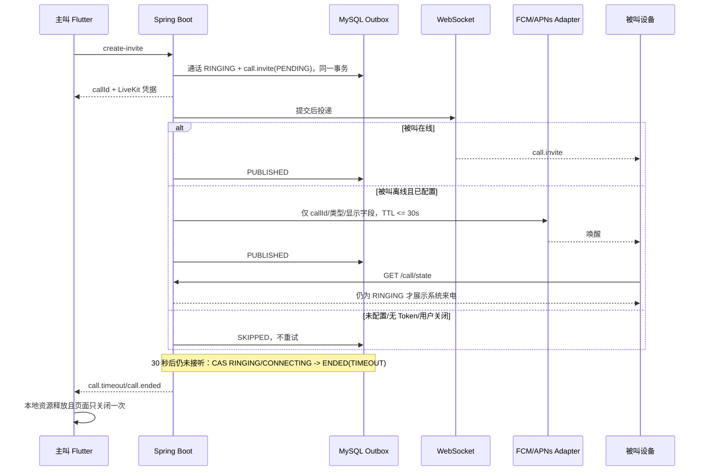

# IM 音视频通话离线推送最低成本部署与异常收敛方案 v1.0

> 状态：可用于实施与验收  
> 适用范围：Android / iOS 单聊与群聊来电；Flutter + Spring Boot + WebSocket + LiveKit  
> 核心原则：媒体与业务私有化，推送只负责唤醒；一次通话、一次终结、有限重试、过期不送。

## 1. 决策摘要

最低成本且不牺牲后续私有化能力的组合为：

1. 前台在线设备继续使用现有 WebSocket 实时信令，零新增外部费用。
2. Android 国际版或具备 Google Play 服务的设备使用 FCM 高优先级 data message。Firebase 官方价格页将 Cloud Messaging 列为 No-cost。
3. iOS 使用 APNs VoIP Push（PushKit）唤醒并立即交给 CallKit 展示系统来电。APNs 不承载 RTC Token；产品发布需要客户自己的 Apple Developer 账号，标准组织会员资格当前为 99 美元/年。
4. 中国大陆 Android 厂商通道不作为首发硬依赖。以 `OfflinePushService` SPI 保留可替换实现，只有客户验收明确要求锁屏/杀进程覆盖时，才选一家聚合推送或按客户设备分布接入厂商通道。
5. 购买方本地化部署时，Spring Boot、MySQL、Redis、WebSocket、LiveKit/TURN 全部留在购买方网络；FCM/APNs 仅收到最小唤醒字段。购买方提供自己的 Firebase/Apple 凭据，不与平台方共享账号。

这一组合把固定外部成本压缩为 Apple 开发者会员费；FCM 本身无消息费用。若购买方完全内网且禁止访问 APNs/FCM，则只能保证应用前台或企业 MDM/自建厂商通道覆盖，不能承诺操作系统杀进程后的通用唤醒。

## 2. 本次故障的系统性结论

原日志不是媒体故障，而是“确定性未配置”被错误归类为“瞬时投递失败”：

- 默认 `OfflinePushServiceImpl` 返回 `false`；
- `CallPushService` 抛异常；
- outbox 将同一事件重复扫描；
- 客户端异常关闭又递归触发 `/cancel`，最终出现数百个 pending 请求。

正确模型必须把结果拆分为：

| 结果 | 是否重试 | outbox 终态 | 示例 |
|---|---:|---|---|
| `DELIVERED` | 否 | `PUBLISHED` | FCM/APNs 接受请求，或存在在线 WebSocket 会话 |
| `NOT_CONFIGURED` | 否 | `SKIPPED` | 私有化客户未启用离线推送 |
| `DISABLED` | 否 | `SKIPPED` | 用户关闭来电通知 |
| `NO_DEVICE` | 否 | `SKIPPED` | 用户无有效设备 Token |
| `PERMANENT_FAILURE` | 否 | `SKIPPED` | Token 无效、凭据无权限、payload 非法；同时失效该 Token |
| `RETRYABLE_FAILURE` | 是，有限次 | `PENDING` 后转 `PUBLISHED/FAILED/SKIPPED` | 连接超时、服务端 429/5xx |

未配置不是错误风暴的理由，也不能伪报成功。它应只记录一次启动级警告和结构化指标，当前通话继续由 30 秒权威超时回收。

## 3. 权威链路



推送不是业务真相。任何冷启动或延迟推送都必须以 `GET /system/im/call/state?callSessionId=...` 二次确认；不是 `RINGING` 时静默丢弃，不展示来电、不请求 LiveKit Token。

## 4. 服务端适配器设计

### 4.1 单一 SPI

保留 `OfflinePushService.pushCallInvite(userId, data)` 为唯一入口，实现返回 `OfflineCallPushResult`。禁止业务服务直接依赖 Firebase Admin SDK、APNs SDK或某一聚合厂商。

建议实现两个独立 Bean：

- `FcmOfflinePushService`：Android FCM HTTP v1；使用服务账号短期 OAuth2 access token。
- `ApnsVoipOfflinePushService`：iOS APNs HTTP/2 token authentication；使用 `.p8`、Key ID、Team ID、Bundle ID。

如需同时支持多平台，增加 `CompositeOfflinePushService`，按用户有效设备逐个路由，再按以下优先级聚合结果：任一成功即 `DELIVERED`；否则有瞬时失败为 `RETRYABLE_FAILURE`；否则为确定性跳过/永久失败。

### 4.2 配置规范

```yaml
im:
  call:
    ring-timeout-seconds: ${IM_CALL_RING_TIMEOUT_SECONDS:30}
    push:
      enabled: ${IM_CALL_PUSH_ENABLED:false}
      ttl-seconds: ${IM_CALL_PUSH_TTL_SECONDS:30}
      max-retries: ${IM_CALL_PUSH_MAX_RETRIES:4}
      fcm:
        enabled: ${IM_CALL_PUSH_FCM_ENABLED:false}
        project-id: ${IM_CALL_PUSH_FCM_PROJECT_ID:}
        service-account-file: ${IM_CALL_PUSH_FCM_CREDENTIALS_FILE:}
      apns:
        enabled: ${IM_CALL_PUSH_APNS_ENABLED:false}
        production: ${IM_CALL_PUSH_APNS_PRODUCTION:false}
        team-id: ${IM_CALL_PUSH_APNS_TEAM_ID:}
        key-id: ${IM_CALL_PUSH_APNS_KEY_ID:}
        key-file: ${IM_CALL_PUSH_APNS_KEY_FILE:}
        bundle-id: ${IM_CALL_PUSH_APNS_BUNDLE_ID:}
```

启动规则：

- `push.enabled=false`：允许启动，明确运行于 `SKIPPED_NOT_CONFIGURED` 模式。
- 任一 provider `enabled=true`：相关必填项缺一即启动失败，禁止运行到发起通话时才发现配置错误。
- 密钥只允许文件挂载或密钥管理服务注入；不进入 Git、数据库、日志、Flutter 包、Docker image layer。
- 开发与生产 APNs 环境严格分离；Bundle ID、Team、entitlement 必须一致。

### 4.3 最小 payload

```json
{
  "schema": "im.call.push.v1",
  "type": "call.invite",
  "callId": "9313e8f729e14dfdab44a97a3eb11fd7",
  "callType": "audio",
  "callerId": "2038793697430458369",
  "callerName": "雷军",
  "chatId": "2070386922573291520",
  "groupId": "",
  "occurredAt": "1787205411239"
}
```

硬性禁止字段：LiveKit access token、API secret、手机号、聊天正文、租户密钥。客户端只以 `callId` 拉取权威状态和一次性 RTC 凭据。

### 4.4 Token 数据模型

Redis 30 天字符串缓存不足以作为企业级设备注册表。实施 provider 时新增持久表 `im_push_device`：

| 字段 | 约束/用途 |
|---|---|
| `id, tenant_id, user_id, device_id` | `(tenant_id,user_id,device_id)` 唯一 |
| `platform` | `ANDROID/IOS` |
| `provider` | `FCM/APNS_VOIP/OEM_*` |
| `token_ciphertext` | 应用层加密，日志永不输出 |
| `app_id, environment` | 区分 Bundle/Application 与 sandbox/production |
| `enabled, invalid_at, last_seen_at` | 生命周期治理 |
| `created_at, updated_at` | 审计 |

登录、Token 刷新时 upsert；退出登录、用户注销、provider 返回明确无效 Token 时失效。一个账号可绑定多个设备；接听成功后服务端 CAS 裁决唯一接听，其余设备收到终态事件并撤销系统来电。

## 5. Android 实施方案

1. Flutter 使用 `firebase_messaging` 取得/刷新 FCM token，但后台消息入口只负责把 `callId` 交给原生来电 UI 网关。
2. 服务端发送 high-priority data message，TTL 不超过通话响铃剩余时间，collapse key 使用 `call:{callId}`。
3. Android 原生使用全屏通话通知/ConnectionService；收到后先调用 state API。终态、过期、无登录态一律不弹窗。
4. 接听/拒绝动作进入同一个 Flutter/原生桥接编排器，禁止原生层另造一套业务状态机。
5. 终态事件到达时，按 callId 撤销通知；重复撤销必须幂等。

FCM 官方说明 high priority 会尝试立即投递并允许设备在 Doze 中被唤醒，但该优先级只应用于确实需要用户可见、时间敏感的内容；来电符合该边界，普通聊天同步不应滥用。

中国大陆交付策略：先统计客户终端是否具备可用 GMS。只有验收数据表明覆盖不足，才启用 `OEM_*` adapter；不修改通话业务层和 Flutter 页面状态机。

## 6. iOS 实施方案

1. Apple Developer 后台为正式 Bundle ID 启用 Push Notifications 与 VoIP 能力，生成 APNs `.p8` key。
2. iOS 注册 PushKit VoIP token，通过受认证 API 绑定到 `im_push_device`。
3. PushKit 回调必须立即向 CallKit 报告来电；随后异步 state 对账，过期则立刻结束对应 CallKit call。
4. 接听后才请求 LiveKit 加入凭据并进入统一 Flutter 通话页。
5. 服务端 APNs 请求使用 `apns-push-type: voip`、正确 topic、短 expiration；结束事件不依赖 VoIP push 保证，应用在线时走 WebSocket，系统 UI 由本地 callId 幂等撤销。

Apple 文档要求 VoIP push 与 CallKit 配合；实现不得收到 PushKit 后等待慢网络请求再决定是否报告，否则可能被系统惩罚。安全做法是立即报告、快速对账、发现过期马上结束。

## 7. 异常退出与防死循环标准

### 7.1 客户端唯一终结门

每个页面实例维护：

- `closing`：首次终结动作同步置 true，后续返回键、按钮、timeout、远端事件直接返回；
- `allowPop`：只有终结完成或本地确定终态后才置 true；
- 控制器 `finalizationFuture`：第一次 `/reject`、`/cancel`、`/hangup`、`/group/leave` 决定最终请求，后续调用复用同一 Future；
- 页面接收“控制器已终态”只做本地 pop，不再发送第二个挂断请求。

禁止把已经开始执行的 `Future` 传入关闭函数；必须传函数引用，先过 `closing` 闸门再创建请求。

### 7.2 超时边界

| 场景 | 客户端 | 服务端 |
|---|---|---|
| create-invite 连接超时 | 尝试一次补偿；释放媒体；关闭页面 | 已落库则 30 秒生命周期 CAS 回收 |
| 媒体连接失败 | 最多一次 cancel/hangup；释放房间/麦克风/相机；关闭 | 终态接口幂等 |
| 30 秒无人接听 | 最多一次 cancel；即使请求失败也关闭 | 生命周期任务作为权威兜底 |
| LiveKit 重连超过 15 秒 | 最多一次 hangup；关闭 | CAS 收敛并发终结 |
| 迟到离线推送 | state 非 RINGING，静默撤销 | outbox invite 标记 SKIPPED |
| 多端同时接听 | 未获胜设备关闭系统 UI | 数据库 CAS 只允许一个设备成功 |

HTTP 客户端对终结接口设置有限 connect/receive timeout，业务层不做自动无限重试。服务端接口以 `callId + 当前状态` CAS 幂等；已结束返回成功语义，而不是制造客户端重试。

### 7.3 outbox 规则

- 只重试 `RETRYABLE_FAILURE`；最大 4 次建议间隔 1、2、4、8 秒，并受剩余响铃 TTL 约束。
- 每次重试前查询通话状态；不是 `RINGING` 立即 `SKIPPED`。
- provider 的 4xx 配置/Token/payload 错误不能重试；429、连接超时和 5xx 可重试。
- `FAILED` 仅代表重试预算耗尽，不反向改变通话记录；通话生命周期自行收敛。
- 指标至少包含 `push_delivered_total{provider}`、`push_skipped_total{reason}`、`push_retry_total`、`push_latency_ms`、`call_timeout_total`；不得以 warn/error 打印每次确定性跳过。

## 8. 成本与交付分级

| 级别 | 覆盖 | 外部成本 | 推荐用途 |
|---|---|---:|---|
| L0 | 前台 WebSocket；后台不保证 | 0 | 本地开发、内网 PoC |
| L1（推荐） | FCM Android + APNs/PushKit iOS | FCM 0；Apple 会员 99 美元/年 | 标准商业交付 |
| L2 | L1 + 中国 Android 聚合/厂商通道 | 按供应商合同 | 明确要求大陆杀进程覆盖的客户 |

不要一开始同时维护华为、小米、OPPO、vivo 四套 SDK。先以 SPI 和设备表稳定接口，再按真实客户覆盖率购买聚合能力，成本和维护风险最低。

## 9. 配置与发布清单

客户需提供：

- Android：Firebase project ID、服务账号 JSON（仅后端）、`google-services.json`（仅 Android app）、正式 applicationId、SHA 配置。
- iOS：Apple Team ID、Key ID、APNs `.p8`、正式 Bundle ID、生产/沙箱环境、签名与 entitlement。
- 网络：后端允许出站访问 FCM/APNs；客户端允许访问业务 API、WebSocket、LiveKit/TURN。

上线前执行：

1. 启动配置校验与密钥文件权限检查。
2. Android/iOS Token 注册、刷新、退出解绑测试。
3. 前台、后台、锁屏、杀进程、断网恢复、推送迟到、Token 失效测试。
4. 单账号双设备同时响铃与唯一接听测试。
5. 连续点击挂断、系统返回键、超时与远端结束并发测试；每个 callId 的终结 HTTP 请求不得超过一次/页面实例。
6. 将 provider 断网 60 秒，确认 outbox 有界重试且通话 30 秒后结束；恢复后不得弹出过期来电。
7. 检查日志、数据库和抓包，确认无 RTC Token、API secret、push token 明文泄漏。

## 10. 验收标准

- 在线被叫 P95 来电事件延迟小于 1 秒（同局域网/正常服务条件）。
- 离线 push 被 provider 接受后，客户端必须二次 state 对账；0 个过期来电被展示。
- 未配置 provider 时仅一次配置警告，outbox 为 `SKIPPED`，不存在同一事件周期性异常堆栈。
- 任意异常路径在 30 秒响铃上限或 15 秒媒体恢复上限后自动离开通话页并释放麦克风、相机、Room。
- 快速点击或并发终态事件不产生 `/cancel`、`/hangup` 请求风暴；同一页面实例只进行一次终结。
- 服务重启、定时任务短暂中断后，创建新通话前的过期回收与生命周期任务均能清除僵尸忙线。
- 无 FCM/APNs 凭据时系统仍可正常运行 L0，不伪报离线推送成功，不影响在线 WebSocket 通话。

## 11. 官方依据

- Firebase Pricing：<https://firebase.google.com/pricing>
- FCM 消息优先级：<https://firebase.google.com/docs/cloud-messaging/customize-messages/setting-message-priority>
- Apple PushKit VoIP 通知：<https://developer.apple.com/documentation/pushkit/responding-to-voip-notifications-from-pushkit>
- Apple Developer 会员比较：<https://developer.apple.com/support/compare-memberships/>

