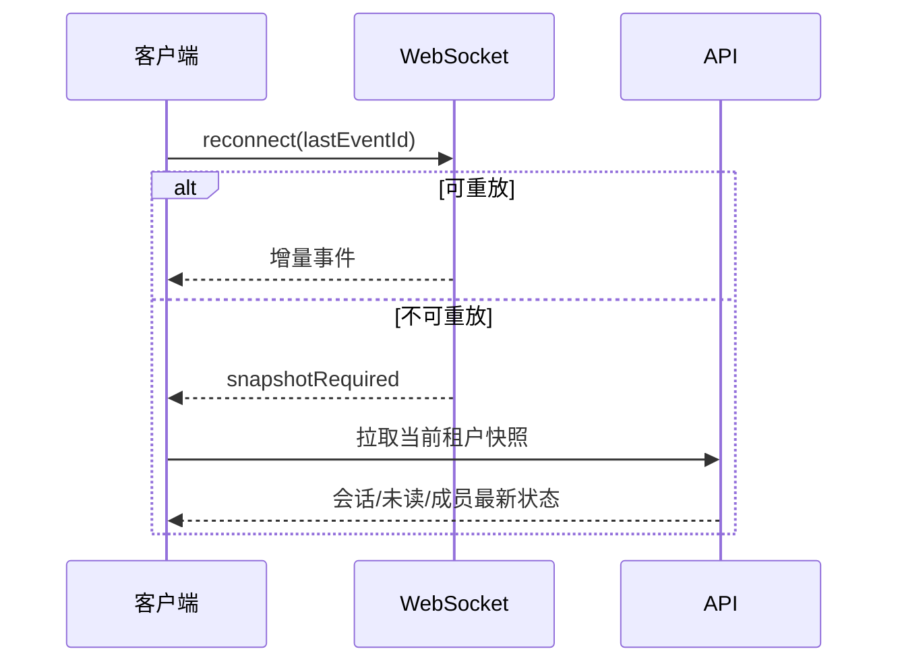
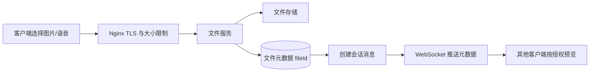
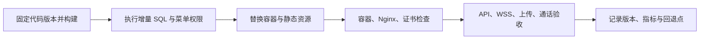

# B 站技术视频脚本：8 分钟拆解一套多租户企业协作系统

> 平台：Bilibili  
> 推荐标题：从多租户到音视频通话：8 分钟拆解企业协作系统的后端与实时架构  
> 推荐封面标题：企业 IM，不只是聊天  
> 推荐配图：`docs/marketing/assets/enterprise-collaboration-architecture.png`

## 视频定位

这不是产品介绍视频，而是一条面向后端、全栈和 Flutter 开发者的工程拆解视频。目标是让观众在短时间内理解：企业协作系统为什么复杂、代码如何分层、实时消息与音视频为什么要分开、以及一套可复现的部署路径。

建议时长 7 到 9 分钟。画面以架构图、工程目录、终端命令、后台页面和 Flutter Web 实机页面交替呈现。不要把画面停留在宣传页，尽量展示真实的目录、日志字段和部署链路。

## 录制前的贴图与素材占位

以下素材不要求一次性全部具备。先使用标注为“可用架构图替代”的内容，后续再逐步替换为真实、脱敏后的截图，视频会更有工程感。

| 编号 | 画面位置 | 素材要求 | 可替代方案 |
| --- | --- | --- | --- |
| P1 | 开场 00:00 | Flutter 会话、通讯录、来电页各一张 | 用主视觉架构图 + 页面名称文字 |
| P2 | 01:25 | 用户加入多企业、切换企业前后对比 | 自绘用户-成员关系图 |
| P3 | 03:15 | 实时事件与音视频双通道图 | 本文 Mermaid 图转 PNG |
| P4 | 04:15 | IDE 目录树与模块说明 | 终端 `tree` 输出截屏 |
| P5 | 06:25 | Nginx 路由、容器状态、云安全组 | 脱敏架构图与 Checklist |
| P6 | 结尾 | README、Gitee、GitHub | 仓库首页截图 |

> **配图位 P0**：在封面下方预留一张 16:9 的总架构图。可直接使用 `docs/marketing/assets/enterprise-collaboration-architecture.png`，后续换成带中文分层标签的版本。

## 分镜与口播

### 00:00 - 00:35：开场，提出真正的问题

**画面**：Flutter Web 的通讯录、会话、通话入口快速切换；随后切到一张分层架构图。

**口播**：

“很多人第一次做企业 IM，会先写一个聊天列表、一个 WebSocket 和一个群聊接口。真正上线后才发现，最难的问题不是消息发出去，而是同一位用户切换企业后为什么还收到旧企业消息，为什么通话能响铃却接听失败，以及为什么管理员配置的权限在移动端表现不一致。今天用一套多租户企业协作系统，拆解这些问题应该分别放在哪里解决。”

### 00:35 - 01:25：整体架构，不把所有复杂性塞进聊天服务

**画面**：展示 `enterprise-collaboration-architecture.png`，叠加以下层次文字。

```text
Vue 3 平台端 / Vue 3 企业管理端 / Flutter 多端
                 |
Spring Boot 业务服务 + 租户、权限、组织、会话
                 |
Netty + Protobuf 实时事件      LiveKit 音视频媒体
                 |
             MySQL + Redis
```

**口播**：

“这个系统把平台管理、企业管理和员工协作拆成三类前端。后端不是只提供 REST API，而是同时维护租户上下文、权限、组织、会话权威状态。实时消息走 Netty 和 Protobuf；音视频媒体交给 LiveKit。这样拆分的关键是，消息事件和媒体流的稳定性目标完全不同，不能用一套连接模型硬扛。”

**加讲 15 秒（可选）**：

“从运维角度看，拆分还有一个好处：消息延迟、接口错误和音视频网络失败可以分别观测。比如 API 返回正常、来电事件已抵达，但媒体协商失败，就不该把问题归为‘聊天服务挂了’。责任边界越清楚，排障越短。”

### 01:25 - 02:20：多租户模型，为什么不能只加一个 tenant_id

**画面**：IDE 打开工程目录与关系图。

```text
User
  -> Membership（用户与企业的成员关系）
  -> Tenant Context（当前企业上下文）
  -> Role / Dept / Data Scope
```

**口播**：

“多租户最容易踩的坑，是只在表里加 `tenant_id`。真正要隔离的是整条访问链路：Token 认证以后解析当前企业，SQL 查询自动带企业范围，Redis key 包含企业标识，WebSocket 连接也要绑定当前企业。否则一个用户加入多家企业后，切换企业只切了页面，缓存和实时订阅还留在旧上下文，串数据几乎是必然的。”

**屏幕标注**：

```text
HTTP：认证 -> 租户解析 -> 权限校验 -> 业务查询
WS：认证 -> 用户/租户绑定 -> 事件订阅 -> 切换时重建作用域
```

**画面补充**：在右侧插入一张“缓存键作用域”卡片：

```text
会话缓存 = tenantId + userId + conversationId
未读缓存 = tenantId + userId
在线设备 = tenantId + userId + deviceId
```

**口播补充**：

“缓存键看起来只是实现细节，实际上它就是权限的一部分。切换企业之后，如果本地数据库、内存索引或未读数还是旧租户的命名空间，用户看到的数据就可能已经越过边界。”

> **配图位 P2**：放一张“切换企业前后”的真实客户端截图，旁边补一张 WebSocket 断开旧订阅、建立新订阅的日志片段。账号、组织名和消息内容全部模糊处理。

### 02:20 - 03:15：组织与会话为什么要分域

**画面**：左边组织树，右边聊天会话列表；展示群成员变化的动画或数据库关系图。

**口播**：

“通讯录记录的是组织事实：部门、成员、岗位、角色。会话记录的是协作事实：单聊、群聊、消息、已读、文件。一个员工调部门，组织树应立即变化，但不能让历史消息消失。一个成员被移出群，应该禁止后续发言，但不应该影响他作为企业员工的身份。把这两类模型分开，才能把权限变化和消息历史各自处理干净。”

**可展示的接口边界**：

```text
组织域：企业、部门、成员、角色、数据权限
协作域：会话、群成员、消息、已读、撤回、附件
```

### 03:15 - 04:15：实时消息与音视频的职责边界

**画面**：分屏展示 WebSocket 事件箭头和 LiveKit 房间箭头。

**口播**：

“实时消息通道负责业务事件：新消息、已读、会话更新、呼叫邀请、成员变化。它需要鉴权、顺序、重连和离线补偿。音视频媒体服务负责房间、媒体协商、音视频流和网络穿透，它关心的是低延迟与网络可达性。业务服务始终保存通话状态的权威记录，媒体服务不替企业业务做权限裁决。”

**画面文字**：

```text
业务状态：created -> ringing -> accepted -> connected -> ended
媒体状态：加入房间 / 发布轨道 / 订阅轨道 / 离开房间
```

**口播补充**：

“当被叫接听后一直转圈，不要先怀疑 UI。按 callId 查业务日志、令牌签发、WSS 连通、浏览器麦克风权限、UDP/TURN 端口，问题会很快从‘感觉不稳定’变成明确的网络或状态机故障。”

**插入排查镜头（20 秒）**：

```text
1. callId 是否从 RINGING 转到 ACCEPTED
2. 客户端是否在点击接听时触发设备权限申请
3. 房间令牌是否仍在有效期内
4. WSS 是否握手成功
5. UDP/TURN 是否可从真机网络访问
6. 任意结束动作是否广播 ENDED 给所有设备
```

**口播补充**：

“把这六步贴在排障文档里，比笼统地让用户提供截图更有效。它能区分业务状态问题、浏览器权限问题和媒体网络问题，也避免为了修 Web 端误改移动端的权限流程。”

> **配图位 P3**：放一张可视化状态机图，或者一段 `callId` 关联日志的时间线截图。

### 04:15 - 05:20：代码架构与模块边界

**画面**：终端执行 `tree -L 2` 或 IDE 目录树，重点高亮以下目录。

```text
shengyu-server/                         # Spring Boot 启动与配置
shengyu-module-*/                       # 领域模块
shengyu-ui/shengyu-ui-platform-vue3/    # 平台管理
shengyu-ui/shengyu-ui-admin-vue3/       # 企业管理
shengyu-ui/shengyu-ui-admin-flutter/    # Flutter Android / iOS / Web
deploy/aliyun/                          # 应用与 Nginx 部署资料
deploy/livekit/                         # 音视频服务与网络验证
sql/                                    # 初始化、增量升级 SQL
```

**口播**：

“代码结构的目标不是目录越多越好，而是让依赖方向清楚。平台端管租户和套餐，企业端管组织与成员，Flutter 面向员工协作。后端负责权威业务状态，实时层只传递事件，媒体层只处理媒体数据。以后增加审批、文件协作或新的客户端时，不需要把原有模块推倒重来。”

**加讲 15 秒（可选）**：

“代码分层还有一个实际收益：功能发布时能形成完整交付单元。一个新功能不只是 Controller 和页面，还应包含增量 SQL、菜单按钮权限、默认授权、环境变量和验收步骤。这样私有化部署时，不会出现接口已经发布、菜单却没有出现的半上线状态。”

> **配图位 P4**：放 IDE 目录树截图，标注每个目录的职责。避免展开具体机密配置与密码文件。

### 05:20 - 06:25：本地启动，给观众一条可验证的路径

**画面**：终端依次执行命令，命令不要一闪而过。

```bash
# 1. 初始化数据库
mysql -u root -p < sql/mysql/1.0/shengyu-saas.sql

# 2. 编译并启动 Spring Boot
mvn clean install
cd shengyu-server
mvn spring-boot:run

# 3. 启动企业 Vue 管理端
cd shengyu-ui/shengyu-ui-admin-vue3
pnpm install
pnpm front

# 4. 启动平台 Vue 管理端
cd ../shengyu-ui-platform-vue3
pnpm install
pnpm front

# 5. 启动 Flutter 客户端
cd ../shengyu-ui-admin-flutter
flutter pub get
flutter run
```

**口播**：

“本地先跑通数据库、后端和两个管理端，再运行 Flutter 客户端。需要容器化开发依赖时，项目也提供 Compose 配置。先让最小链路能运行，再调试实时消息和通话，排错成本会小很多。”

```bash
cd deploy/local-docker
docker compose --env-file docker.local.env -f docker-compose.local.yml up -d
```

### 06:25 - 07:25：生产部署，域名、WSS 与 UDP 才是重点

**画面**：Nginx 路由示意图、Docker Compose、服务器安全组页面（脱敏）。

```bash
cd /opt/shengyu/saas-deploy
docker compose --env-file docker.prod.env \
  -f docker-compose.yml \
  -f docker-compose.prod-host.yml \
  up -d --build server admin-vue3 platform-vue3 im-flutter-web kkfileview
```

**口播**：

“生产上经常见到的一种误区是：网页能打开，就以为实时能力也部署好了。实际上 API、WebSocket、Flutter Web 页面和音视频服务最好使用各自清晰的域名边界。Nginx 要转发 WebSocket Upgrade，证书覆盖 WSS 域名，上传大小限制在 Nginx 和后端都要配。音视频还需要确认 UDP、TURN 和媒体端口已在云安全组开放。”

**画面文字**：

```text
页面域名 != API 域名 != WebSocket 域名 != RTC 媒体服务域名
```

**插入验收镜头（20 秒）**：

```text
静态页：首次打开与刷新都加载正确版本
API：登录、切换企业、会话列表返回正确
实时：WSS Upgrade、重连、离线补偿正常
上传：图片与语音文件可上传、下载、预览
通话：不同网络下能完成呼叫、接听、结束
```

> **配图位 P5**：放脱敏后的 Nginx 域名路由图和 Docker 容器 `Up` 状态截图。不要录入公网 IP、证书私钥、数据库密码或完整日志正文。

### 07:25 - 08:00：收束与开源地址

**画面**：回到架构图，再显示项目 README 和开源仓库。

**口播**：

“企业协作系统的核心，不是把所有功能塞进一个服务，而是让租户、权限、会话、实时事件和媒体网络各自有明确责任。这样系统才能在多企业、多端和复杂网络条件下持续演进。完整代码、部署说明和 SQL 都在下面两个仓库。”

## 视频简介

这期从工程角度拆解一套多租户企业协作系统：Spring Boot 如何承载租户与权限，Vue 3 的平台端和企业端如何分工，Flutter 如何覆盖移动端与 Web，Netty + Protobuf 如何做实时业务事件，以及为什么 LiveKit 与 TURN 应独立承担音视频媒体能力。

视频还会给出本地启动、Docker Compose 生产部署、Nginx/WSS 与云安全组排查的关键命令。适合正在做企业管理系统、即时通信、Flutter 多端或音视频接入的开发者参考。

## 推荐标签

`Spring Boot` `Vue3` `Flutter` `企业IM` `WebSocket` `Netty` `Protobuf` `LiveKit` `Docker` `Nginx` `SaaS` `系统设计`

## 素材清单

| 素材 | 用途 | 建议时长 |
| --- | --- | --- |
| 企业协作架构图 | 讲分层与数据流 | 20 秒，可多次复用 |
| Flutter Web 会话/通讯录/通话页面 | 开场与多端效果 | 15 秒 |
| 两套 Vue 管理端 | 平台、企业职责边界 | 20 秒 |
| IDE 目录树 | 代码架构说明 | 30 秒 |
| 终端启动与 Compose 命令 | 本地/生产部署 | 40 秒 |
| 脱敏后的 Nginx、容器与日志 | 运维和排障说明 | 30 秒 |

## 备用 3 分钟加长段：从“事件到了”到“状态正确”

如果视频希望扩展到 10 至 12 分钟，可以在生产部署段之后追加这一节。

**画面**：一个消息事件的 `eventId`、`eventType`、`tenantId`、`occurredAt` 字段示意，再展示客户端重连流程图。

**口播**：

“实时系统里最容易被忽略的是：事件抵达不等于状态正确。移动端从后台恢复、浏览器休眠、网络切换都可能带来重复事件或事件缺口。因此每个实时事件建议有唯一 `eventId`、明确类型和服务端时间。客户端重连时携带上次已处理位置，服务端在可补偿窗口内重放增量；如果窗口已经过期，就回拉会话、未读数和成员关系快照。这样实时通道保证及时性，HTTP 快照保证最终正确性。”



> **配图位 P6**：可放浏览器 DevTools 的 WS 帧截图或一段 Flutter 脱敏日志，突出重连与快照回拉。

## 备用 4 分钟加长段：消息、文件与发布为什么要一起设计

这段适合在观众反馈“想看更细的工程实现”后制作第二期，或与前面的加长段拼成 12 至 15 分钟完整视频。

### 08:00 - 09:20：为什么消息不能直接塞文件二进制

**画面**：左侧画“错误链路：大文件 -> WebSocket”，右侧画“推荐链路：上传 -> fileId -> 消息引用 -> 预览”。



**口播**：

“文件传输和消息语义要分开。图片、语音、附件先通过上传链路写入文件存储，并保存 `fileId`、大小、类型、哈希和所属租户；会话消息只引用这个 `fileId`。这样大文件不会阻塞实时事件，下载也能按当前租户做权限校验。线上真机上传失败时，就能从移动网络、HTTPS、Nginx、后端 multipart、存储权限逐层排查。”

> **配图位 P7**：放一张脱敏的图片/语音上传成功后出现在会话中的客户端截图，旁边附一张简化文件元数据表。

### 09:20 - 10:30：为什么事件允许重复，业务却不能重复

**画面**：展示 `clientRequestId`、`eventId`、`eventType` 三个字段的卡片。

**口播**：

“弱网下用户可能点两次发送，服务端也可能在重连后重投同一事件。成熟系统不必承诺事件绝对只来一次，但必须确保业务状态不会被重复创建。客户端命令携带 `clientRequestId` 做幂等，服务端事件带 `eventId` 做去重；数据库事务成功后再投递事件；当事件出现版本缺口时，客户端回拉权威快照。”

```text
业务命令：clientRequestId -> 防止重复创建
实时事件：eventId -> 防止重复消费
状态版本：eventVersion -> 发现乱序与缺口
```

> **配图位 P8**：使用一张四步骤信息图：`命令落库 -> 事务提交 -> 推送事件 -> 客户端去重/回拉`。

### 10:30 - 11:40：部署不是一条命令，而是一条验证流水线

**画面**：使用流程图、脱敏 Compose 命令与逐项勾选的验收表。



**口播**：

“一次完整发布不只是 `docker compose up -d`。代码、增量 SQL、菜单权限、环境变量和验收结果应该一起交付。先保证后端对旧客户端兼容，再替换 Web 页面，移动端通过版本机制逐步升级。每一步留一个可回退点，线上出现问题时才不用靠记忆救火。”

> **配图位 P9**：放一张真实但脱敏的发布记录清单，展示版本号、变更项、SQL、验证人、回退镜像标签等字段。

## 开源地址

- Gitee：[https://gitee.com/jinzheyi/yubb-saas-pro](https://gitee.com/jinzheyi/yubb-saas-pro)
- GitHub：[https://github.com/jinzheyi/yubb-saas-pro](https://github.com/jinzheyi/yubb-saas-pro)
