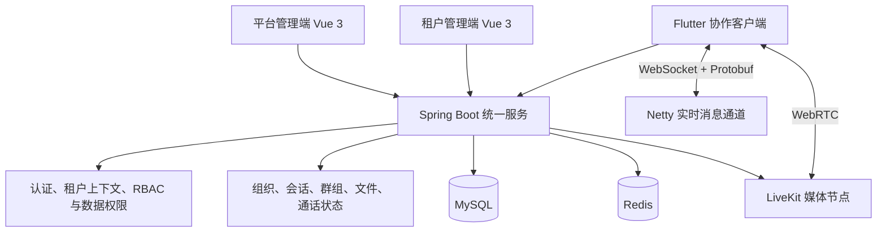
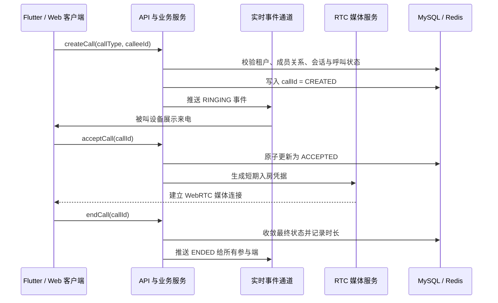
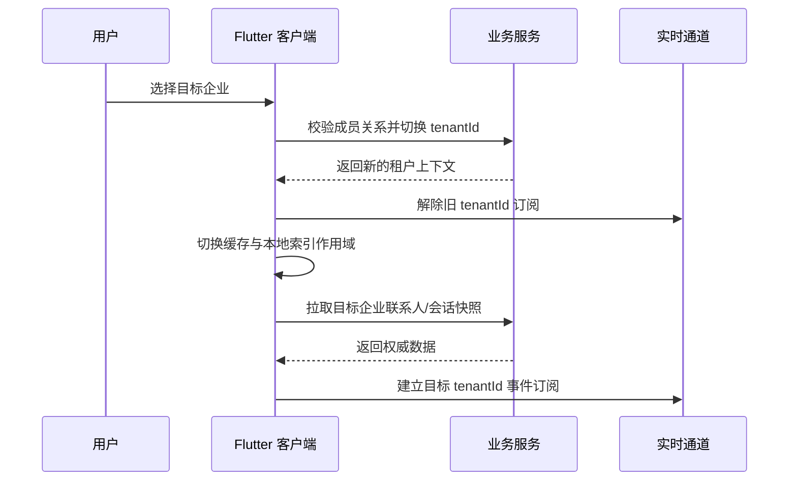
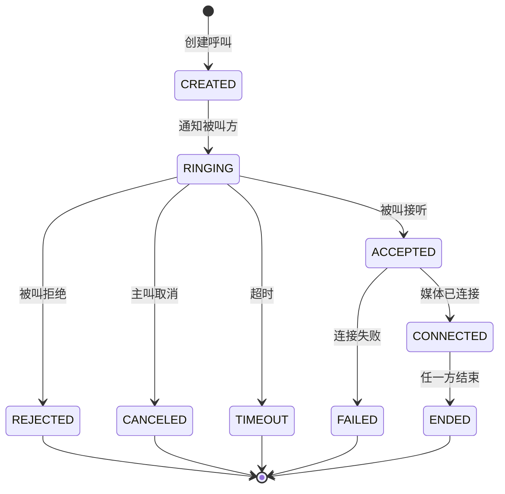
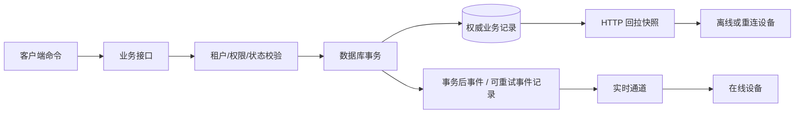
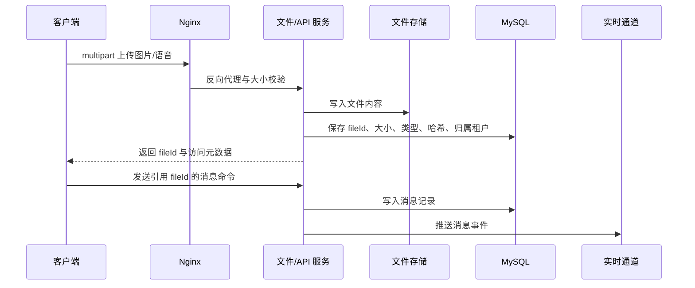

# 企业 IM 为什么不能只依赖聊天 SDK：多租户、权限与通话状态的工程拆解

> 平台建议：CSDN
>
> 建议分类：后端 / Java
>
> 建议标签：`Java` `Spring Boot` `WebSocket` `Flutter` `多租户` `音视频`

很多即时协作项目都会从“先接一个聊天 SDK”开始。消息发通以后，复杂性才真正出现：组织通讯录由谁维护？员工调岗、离职后谁负责收回可见范围？一个账号加入多家企业时，怎么避免把 A 企业会话带到 B 企业？通话超时后，为什么一端已经挂断、另一端还在响铃？

这些问题的共同点是：它们不只是通讯问题，而是企业业务边界问题。本文以一个 Spring Boot + Vue 3 + Flutter 的多租户协作系统为例，拆解实现企业即时协作时最值得先做对的几件事。


> 发布时上传本图：`docs/marketing/assets/enterprise-collaboration-architecture.png`。
>
> **配图位 A（建议放在这里）**：一张脱敏后的三端总览截图。左侧放平台管理端的租户列表，中间放企业管理端的组织树，右侧放 Flutter 会话列表。图注建议：`同一身份体系下的平台、企业与员工协作入口`。

## 1. 先确定职责：管理、实时消息、实时媒体不要混为一层

一个更容易长期维护的系统，至少应分为四个边界：



这里的关键不是组件数量，而是责任归属。

- **Vue 平台端**管理租户、套餐与平台级配置。
- **Vue 租户端**管理部门、岗位、成员、角色、菜单和数据权限。
- **Flutter 客户端**只承载员工侧协作体验：联系人、会话、群组、文件、通知和通话。
- **Spring Boot 业务服务**是组织边界和通话最终状态的事实来源。
- **Netty + Protobuf**处理实时 IM 的低开销连接与消息通道。
- **LiveKit**只负责实时媒体传输、房间和 WebRTC 协商，不接管租户、权限或业务记录。

把实时媒体和业务状态分开，最大的收益是故障不再互相污染。媒体节点短暂不可用时，业务端仍可以准确标记呼叫失败或结束；组织权限发生变化时，业务端仍有唯一入口决定谁能发起或加入通话。

### 一个更完整的请求与事件视角

从客户端发起“给同事拨打语音电话”开始，系统里至少有两条链路同时发生：一条是业务命令链路，一条是媒体数据链路。把它们画在同一张图里，很多设计取舍会更直观。



这里最值得坚持的原则是：**媒体连接是通话状态的输入，不是通话状态的唯一事实**。例如被叫已经接受，但其网络无法建立媒体连接，服务端仍需要将本次呼叫标记为失败并向两端广播结果；不能只依赖某个页面是否关闭来判断通话是否结束。

> **配图位 B（建议放在这里）**：截取一次真实呼叫的脱敏日志时间线，展示 `callId` 从创建、响铃、接听到结束的四到六条日志。图注建议：`业务状态与媒体连接分别观测，避免跨层猜测`。

## 2. 组织数据不能维护两遍

不少系统把“后台用户”和“IM 用户”当成两套模型同步。初期这样很快，后期往往会带来三类问题：

1. 部门或岗位变化后，通讯录没有及时刷新。
2. 已离职用户仍能通过旧 token 或旧会话看到信息。
3. 数据权限在业务页面生效，但群聊、文件和会话列表绕开了它。

更稳妥的方式是让租户侧的组织模型成为协作范围的基础。成员、部门、角色和数据权限仍由业务系统维护；协作端在登录或切换企业后，通过服务端计算得到当前可见联系人、可访问会话与可操作功能。

从请求链路看，可以把它理解成这样：

```text
Access Token
  -> 解析当前用户
  -> 校验当前租户成员关系
  -> 装载 tenantId / roleIds / dataScope
  -> 查询组织、联系人、会话、文件与通话资源
```

这条链路要保证所有入口一致，包括 HTTP API、WebSocket 鉴权、文件下载和通话 token 签发。真正危险的不是“查不到数据”，而是某个旁路忘记带租户上下文，误把不属于当前企业的数据返回给客户端。

## 3. 多租户切换不是 UI 行为，而是安全上下文切换

客户端的“当前企业”只是体验层状态。一次安全的租户切换至少包含：

```text
选择目标企业
  -> 服务端校验成员关系与状态
  -> 重新生成或刷新租户上下文
  -> 客户端清理旧租户缓存、未读数、列表状态
  -> 使用新上下文请求组织和会话数据
  -> 重连实时通道或刷新实时订阅范围
```

特别是 Flutter 这类多端客户端，缓存策略要和身份边界一起设计：数据库缓存、内存缓存和 WebSocket 推送都必须以用户与租户双维度隔离。只用 `conversationId` 作为本地键不够，至少应考虑 `userId + tenantId + conversationId` 的组合。

将切换过程画成时序图，可以看出为什么“只刷新会话列表”不足以保证隔离：



关键顺序是先解除旧订阅、再切换本地作用域、最后加载新快照并订阅新事件。若先订阅后切缓存，短时间内到达的旧租户事件可能已经写入新页面。

> **配图位 G（建议放在这里）**：把该时序图导出为横向架构图，标题建议为“租户切换不是刷新页面，而是重建安全作用域”。

### 缓存隔离不是性能细节，而是权限实现的一部分

客户端为了获得更快的会话列表和离线浏览能力，通常会缓存联系人、会话、草稿、未读数和最近消息。缓存有价值，但它不应该绕过权限边界。推荐先定义作用域，再讨论缓存介质：

```text
sessionScope = userId + ':' + tenantId
conversationScope = sessionScope + ':' + conversationId
memberScope = tenantId + ':' + memberId
```

当用户切换企业时，正确的动作不是“刷新一个接口”，而是：停止旧作用域的事件消费、清理或冻结旧作用域内存索引、加载新作用域快照、再建立新的实时订阅。这样即使用户在两家企业中都与同一个人存在单聊，也不会因为会话 ID、草稿或未读数复用而彼此污染。

## 4. 通话要用状态机，而不是用前端弹窗模拟

“点击呼叫，拉起 LiveKit 房间”不是完整通话。业务层至少要维护以下状态：



这套状态机要由服务端裁决，原因很具体：

- 主叫超时后，必须向全部在线设备广播停止响铃事件。
- 被叫在另一台设备接听后，其余设备必须同步关闭来电页。
- 断网重连后，客户端要查询服务端最终状态，不能只恢复本地 UI。
- 通话历史、未接来电与消息提醒应从最终状态派生，避免出现多份矛盾记录。

媒体连接成功只是 `CONNECTED` 的一个条件，不能替代业务状态。这样实现后，即使媒体服务、网络和客户端发生异常，也能把“业务上这次通话到底发生了什么”保留为可追踪的数据。

## 5. WebSocket 和 HTTP API 各自解决什么问题

实时协作常见误区是把所有能力都塞进 WebSocket。更合理的分工是：

| 场景 | 建议通道 | 原因 |
| --- | --- | --- |
| 登录、组织查询、历史记录、文件元数据 | HTTPS API | 请求响应清晰，便于鉴权、分页和审计 |
| 新消息、会话变更、呼叫事件、在线状态 | WebSocket | 低延迟主动推送 |
| 图片、语音、附件本体 | 文件服务 / 对象存储 | 不让长二进制消息阻塞实时通道 |
| 音视频媒体 | WebRTC / LiveKit | 适合低延迟媒体与 NAT 穿透 |

实时消息使用 Protobuf 而不是 JSON 并不只是节省字节数。固定的消息结构、字段编号和向后兼容规则，可以让客户端逐步升级；服务端可以保留协议版本与消息类型的显式分发，而不是在字符串字段里猜业务语义。

### 事件协议的三个工程约束

实时协议无需一开始就复杂，但至少应让以下三个字段成为一等公民：

```text
eventId       # 全局唯一，用于去重与日志关联
eventType     # MESSAGE_CREATED / CALL_ENDED / MEMBERSHIP_CHANGED 等
occurredAt    # 服务端产生时间，用于排序、诊断与过期判断
```

客户端收到事件时，不要假设“每条都只会来一次、一定按顺序到达”。网络重连、服务端重投、移动系统后台恢复都可能造成重复与乱序。实践中可采用“事件去重 + 版本号/时间戳比较 + 必要时回拉快照”的组合：小事件走增量更新，发现会话版本有缺口时再通过 HTTPS 拉取权威列表。这样 WebSocket 承担低延迟体验，HTTP 承担状态修复能力。

> **配图位 C（建议放在这里）**：放一张 WebSocket 事件抓包或浏览器 Network 截图，重点框出 `eventId`、事件类型与租户字段；务必脱敏 Token、用户标识和内容。

## 6. 私有化部署时，网络拓扑比 Docker 命令更重要

本地开发可以一条 Compose 命令启动基础环境：

```bash
cd deploy/local-docker
docker compose --env-file docker.local.env -f docker-compose.local.yml up -d
```

生产环境则要区分宿主机基础设施、应用容器与媒体节点。以已有 MySQL、Redis 的服务器为例，后端、两个 Vue 前端、Flutter Web、文件预览和 LiveKit 可以容器化，而 MySQL 与 Redis 不重复装进 Compose。

```bash
cd /opt/shengyu/saas-deploy
docker compose --env-file docker.prod.env \
  -f docker-compose.yml \
  -f docker-compose.prod-host.yml \
  up -d --build server admin-vue3 platform-vue3 im-flutter-web kkfileview
```

Nginx 的职责也要明确：

- 管理端与 Flutter Web 只代理静态页面容器。
- API 和 WebSocket 使用统一的 API 域名，避免页面域名混用。
- 上传入口的 `client_max_body_size` 要与后端 multipart 限制一致。
- LiveKit 信令使用 WSS；WebRTC 的 UDP/TCP、TURN 与中继端口需要在云安全组按协议放通。

对于 Flutter Web，还应避免把关键启动资源放到不稳定的第三方 CDN。构建产物中的 `index.html`、`main.dart.js`、`flutter_bootstrap.js` 等入口文件不宜设置长缓存；CanvasKit 等运行资源优先随站点部署，才能降低首屏白屏或慢启动的概率。

### 生产发布应分为“构建、替换、验证、回退”四步

容器化并不自动等于可发布。一次可控发布至少需要把以下内容写进部署记录：

| 阶段 | 关键动作 | 需要验证的结果 |
| --- | --- | --- |
| 构建 | 固定代码版本、环境变量与镜像标签 | 构建日志无配置回退或依赖下载异常 |
| 替换 | 仅重建发生变更的服务 | 容器健康检查通过，旧容器已退出 |
| 验证 | API、WebSocket、上传、Flutter Web、通话分别验收 | 页面、接口、WSS 和媒体链路都可用 |
| 回退 | 保留上一版镜像与配置快照 | 可在有限步骤内恢复上一稳定版 |

服务上线后先检查容器和反向代理，再检查真实业务。一个很实用的验收顺序是：`HTTPS 首页 -> 登录 -> 租户切换 -> 联系人 -> 单聊消息 -> 文件上传 -> 群聊 -> 语音/视频呼叫`。前面的步骤通过，后面的异常才更容易归因。

> **配图位 D（建议放在这里）**：放一张脱敏后的 Docker 容器状态与 Nginx 域名路由图。图注建议：`宿主机基础设施与容器化应用的职责边界`。

## 7. 增量 SQL 与菜单权限：别把“代码上线”当成完整发布

企业系统新增功能时，数据库结构、字典、菜单、按钮权限和默认角色往往同时变化。只发布 JAR 或前端静态文件，容易得到“接口已经存在，但管理端没有菜单”或“菜单看得见、没有数据权限”的半成品状态。

建议每一项功能都按同一交付单元组织：

```text
领域代码
  + 数据库增量 SQL
  + 菜单与按钮权限 SQL
  + 默认角色授权策略
  + 前端路由/页面
  + 生产环境执行与验收记录
```

SQL 本身也应满足可重复执行或可安全识别已执行状态的要求。线上执行前先备份，再在预发布或本地副本验证；执行后检查表结构、菜单显示、权限接口和关键业务数据。这个流程比“线上临时改一条 SQL”慢一点，但会大幅降低租户级功能发布的不确定性。

## 8. 事务与实时事件：不要在数据库提交前把“成功”推给客户端

消息发送、加群、退出群、创建呼叫这些动作都有同一个工程难点：数据库状态和实时事件不是同一种资源。若在数据库事务尚未成功提交时就向 WebSocket 推送“新消息”，后续事务回滚，客户端却已经展示了一个不存在的消息；若数据库成功但推送失败，在线端又会短暂看不到变化。

对于这类跨边界动作，至少需要明确两个原则：数据库记录先成为权威事实，事件需要能够安全重试。客户端则应携带请求级唯一标识，例如 `clientRequestId`，服务端将其与用户、租户和动作组合起来做幂等判断。



```text
idempotencyScope = tenantId + ':' + userId + ':' + action + ':' + clientRequestId
```

这里不必执着于“每一条事件绝不重复”。更实用的目标是：业务命令至多产生一次权威状态变化，事件允许至少一次投递，客户端按 `eventId` 去重并在版本缺口出现时回拉快照。这样弱网下重复点击发送或接听，也不会生成两条消息或两路并行呼叫。

> **配图位 E（建议放在这里）**：将本节 Mermaid 图转换为横版图，右侧加三条短注释：`事务先落库`、`事件可重试`、`重连可回拉`。

## 9. 图片、语音与附件：把二进制传输从消息语义中剥离

即时通讯里的图片和语音往往最先暴露生产环境差异：Web 测试可上传，真机提示服务端异常；小文件正常，大文件被 Nginx 拦截；消息已经发送，附件却还没有完成存储。

一个更可控的附件模型是两阶段的：先完成文件传输与元数据登记，再发送引用该文件的业务消息。聊天消息持有的是 `fileId`、媒体类型、大小、时长和缩略信息，而不是把文件二进制塞进 WebSocket 帧。



文件元数据至少应包含所属租户、上传者、用途、大小、内容类型和完整性校验信息。下载和预览时仍需按当前租户和资源关系校验，不能因为拿到静态 URL 就放弃授权。对图片、语音、视频的大小限制，要同时在客户端提示、Nginx 的 `client_max_body_size` 和 Spring Boot multipart 配置中保持一致。

> **配图位 F（建议放在这里）**：放一张“图片上传 -> 会话内展示”的脱敏组合图，旁边用小型箭头标注 `文件先入库，消息引用 fileId`。

## 10. 性能不是单一指标：把首屏、列表、长连接和媒体分别量化

企业协作客户端的性能问题常被统称为“卡”。实际至少应分四类指标：

| 维度 | 典型指标 | 优化方向 |
| --- | --- | --- |
| 首次打开 | 启动脚本下载、首帧、首个可交互时刻 | 入口缓存策略、按需初始化、站内资源 |
| 列表操作 | 会话滚动、联系人树展开、未读更新 | 分页、虚拟列表、局部状态更新 |
| 实时连接 | 建连耗时、重连成功率、事件延迟 | 心跳、退避重试、增量重放与快照回拉 |
| 媒体体验 | 加入房间耗时、首帧、丢包、重连 | TURN/UDP 网络、码率策略、设备适配 |

Flutter Web 的启动链路需要重点关注入口 HTML、启动脚本、主产物与运行时资源的缓存关系；而移动端还要关注前后台切换、系统网络变化和设备权限恢复。两端可以共用业务状态机与接口协议，但不应强行使用同一种本地存储与初始化策略。

## 11. 实际落地时的检查清单

上线前我通常会逐项确认：

```text
[ ] API、WebSocket、媒体服务分别使用正确域名
[ ] 租户切换后本地缓存与实时连接已经刷新
[ ] 呼叫超时、拒绝、取消、断线都有终态
[ ] 文件上传限制在 Nginx 与 Spring Boot 一致
[ ] TLS 证书、WSS、RTC UDP/TCP、TURN 端口均已验证
[ ] 镜像构建产物、环境变量和回滚命令可复现
[ ] 日志中不输出 token、密码、媒体密钥或完整个人信息
```

企业即时协作的难点从来不在于“能不能发一条消息”，而在于高频协作能否遵守组织、权限、租户和状态规则。先守住这些边界，消息与音视频能力才有可持续扩展的基础。

开源地址：

- Gitee：<https://gitee.com/jinzheyi/yubb-saas-pro>
- GitHub：<https://github.com/jinzheyi/yubb-saas-pro>
