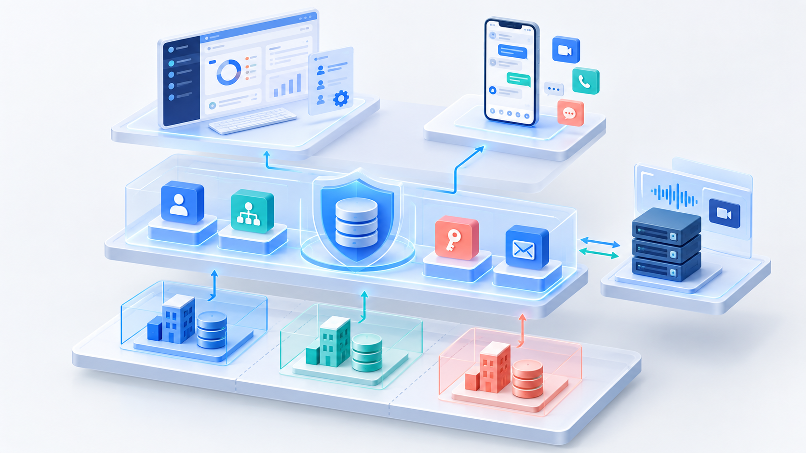
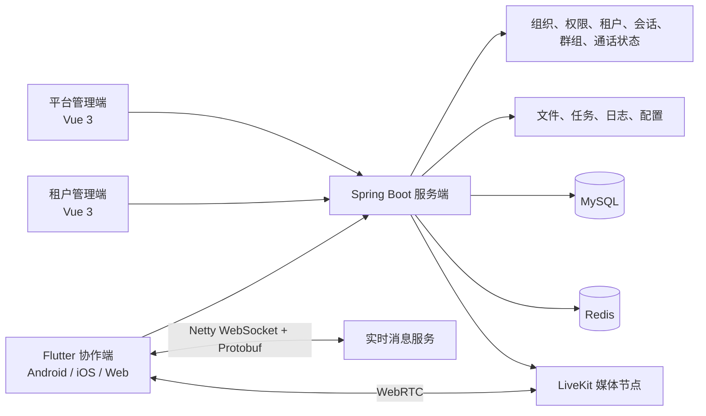
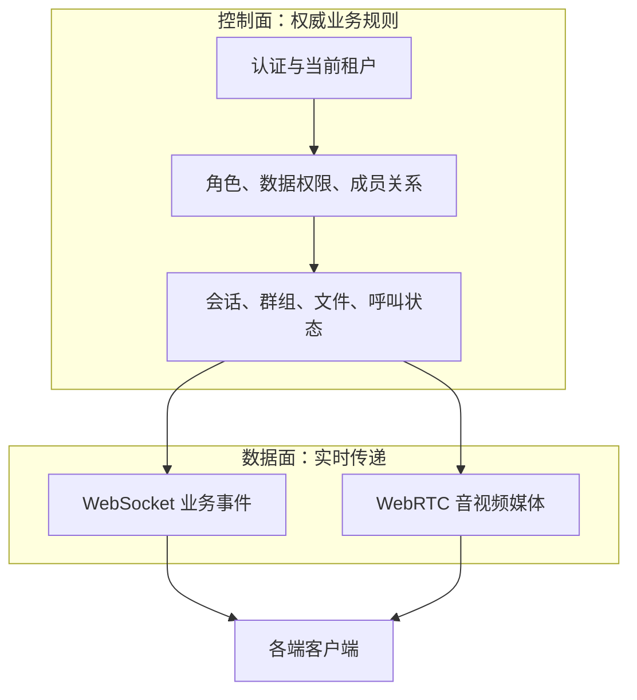
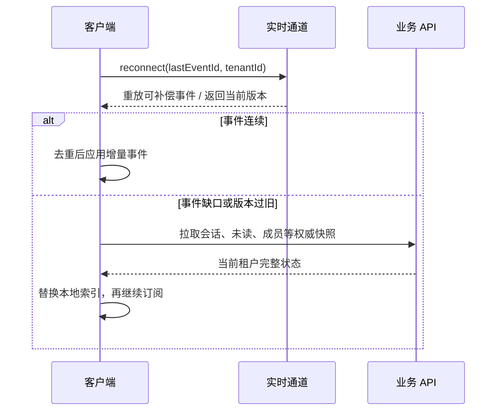
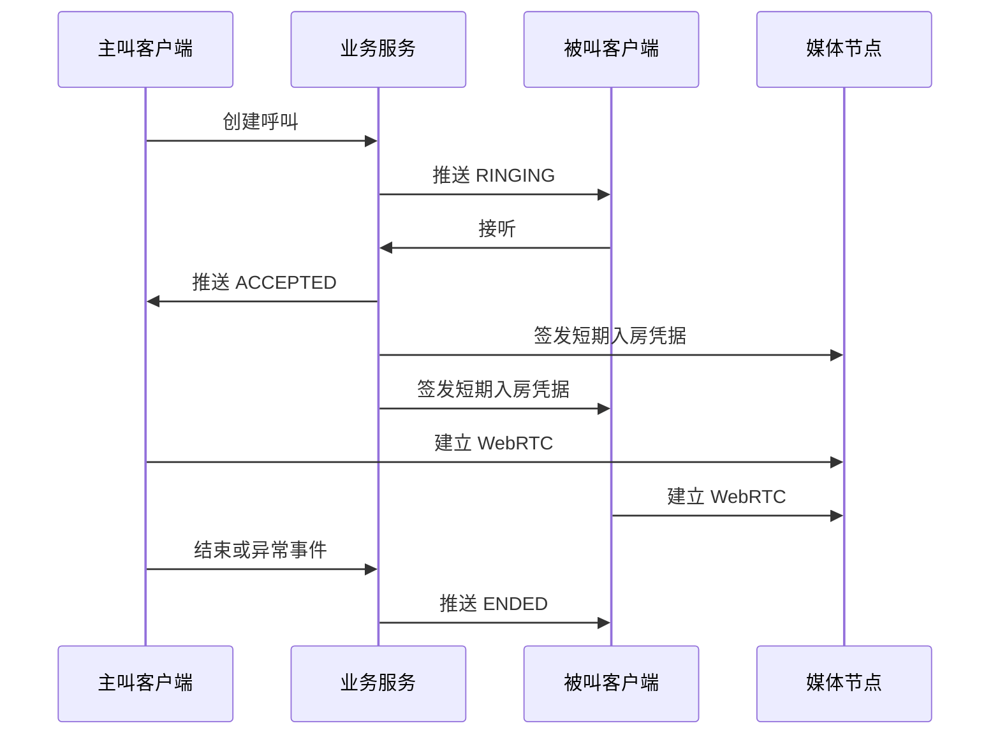
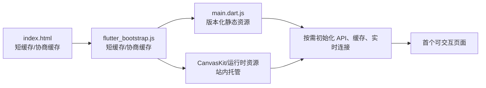
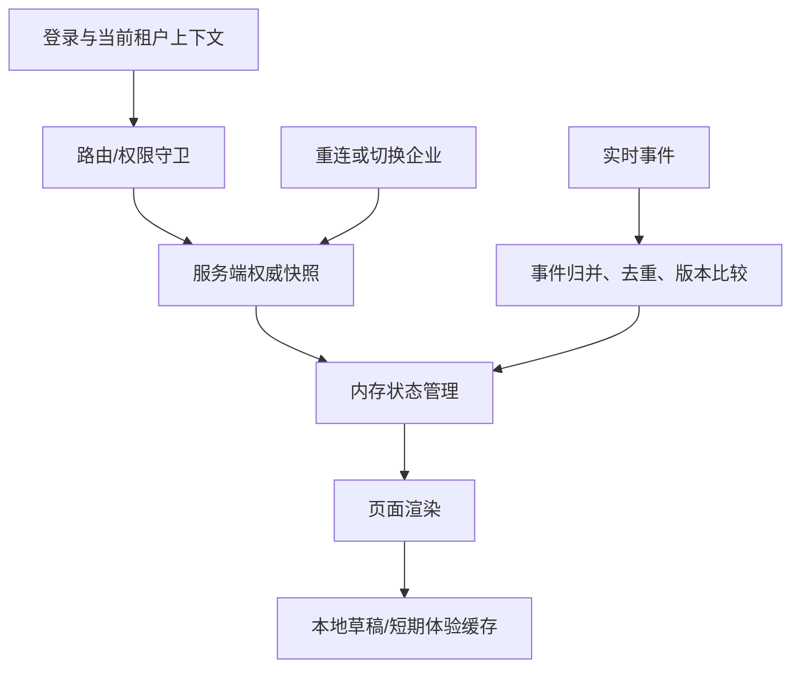
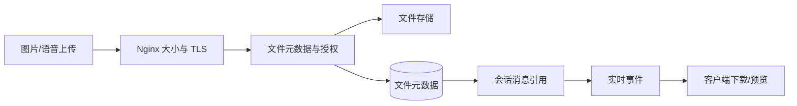

# 从后台系统到企业协同产品：一次把多租户、Flutter 与实时通话串起来的工程复盘

> 平台建议：掘金
>
> 建议分类：后端
>
> 建议标签：`Java` `Flutter` `架构设计` `WebSocket` `音视频`

做企业协同，最容易犯的错误是把它拆成两个互不相干的项目：一边是“后台管理”，另一边是“聊天 App”。前者有组织、岗位、权限和流程；后者有联系人、会话、群聊和通话。两边各自跑起来不难，难的是它们开始共享同一批员工、同一份租户数据、同一套访问边界之后，如何保持一致。

这篇文章记录我在一个多租户协作系统中做架构收敛时的思路。它不是组件清单，而是从几个会反复出问题的场景出发：用户加入多家企业、部门权限改变、手机与 Web 同时在线、通话超时、Flutter Web 首屏慢、客户服务器没有完整云原生基础设施。



> 发布时上传本图：`docs/marketing/assets/enterprise-collaboration-architecture.png`。
>
> **配图位 A（建议放在这里）**：三张界面拼图，依次为平台租户管理、企业组织管理、Flutter 协作首页。图注：`同一套身份与租户边界在三个产品入口中的投射`。

## 从四个端开始，而不是从一条消息开始

系统的端到端关系可以压缩成下面这张图：



平台端、租户端和客户端并不是三套独立产品。它们是同一份身份和授权体系的三个入口：

- 平台端处理平台级租户、套餐与公共配置。
- 租户端处理企业自己的部门、成员、角色、菜单和数据范围。
- Flutter 客户端消费这些组织边界，提供联系人、会话、群组、文件和通话体验。

服务端负责把“这个人现在属于哪家企业、能看到什么、能对什么执行操作”变成真实约束；实时消息与媒体能力只是在这个约束下工作。

这里可以再补一张“控制面与数据面”的图。平台、企业和协作客户端都通过控制面获取身份、权限与业务状态；消息事件和媒体数据则走各自更适合的通道。控制面出问题会影响规则，数据面出问题会影响实时体验，两者要能被独立升级和定位。



> **配图位 B（建议放在这里）**：将上图替换为一张自行绘制的“控制面 / 数据面”双色架构图。建议使用两种稳定色，不要把具体服务器 IP、Token 或私网拓扑放进公开图。

## 第一件事：让租户上下文穿过所有通道

多租户系统最值得防的不是查询性能，而是上下文遗漏。一个 HTTP 接口做了租户过滤，并不代表 WebSocket 订阅、文件下载、通话 token 或缓存键也做了同样的过滤。

我会把一个请求最少拆成四步：

```text
认证凭据
  -> 用户身份
  -> 当前租户成员关系
  -> 角色 / 菜单 / 数据范围
  -> 目标资源校验
```

对本地缓存也一样。不要只用 `conversationId` 做键；当同一账户能切换多个企业时，应把用户和租户加入缓存维度。对于客户端数据，可以理解为：

```text
cacheKey = currentUserId + ':' + currentTenantId + ':' + businessResourceId
```

这并不意味着每一层都要写一遍复杂判断。相反，应该把租户上下文装载、数据权限拦截和鉴权入口收敛在框架层或统一服务层，让业务代码尽量只表达业务意图。

### 一次请求如何避免越过租户边界

可以把服务端的处理过程理解为一个不可跳过的管道：

```text
request
  -> 身份认证（谁在访问）
  -> 当前企业解析（以哪家企业身份访问）
  -> 成员状态校验（是否仍有效）
  -> 角色与数据范围校验（能访问哪些资源）
  -> 业务资源归属校验（目标资源是否属于当前企业）
  -> 执行业务并写入审计所需的关联字段
```

最后一层“资源归属校验”很关键。即使用户确实属于某个企业，也不等于客户端传来的任何 `conversationId`、`fileId`、`callId` 都可访问。业务资源自身必须能回溯所属租户和成员关系，避免用一个猜到的 ID 越权读取或操作数据。

在缓存层可以同步采用作用域命名：

```text
im:conversation:{tenantId}:{userId}:{conversationId}
im:unread:{tenantId}:{userId}
im:presence:{tenantId}:{userId}:{deviceId}
```

缓存键不是安全校验的替代品，但清晰的键空间会使排错和主动失效更可靠。切换企业时只需要处理目标 `tenantId` 所属的键空间，而不是粗暴清空整个客户端或 Redis。

## 第二件事：组织模型才是协作模型的上游

联系人不是一张孤立的用户表。企业里真正影响协作范围的是部门、岗位、成员状态、角色和数据权限。

如果把后台组织和 IM 联系人分开维护，后续会不断出现同步任务：部门更名要同步，人员离职要同步，禁用账号要同步，角色变化还要同步。同步越多，最终一致性就越难解释。

更好的路径是：

1. 租户管理员在管理端维护企业组织。
2. 服务端计算当前用户可见的人与资源。
3. 客户端按当前租户拉取联系人、会话和群组。
4. 成员状态变化时，以服务端事件刷新相关会话和实时订阅。

这样做的直接结果是，员工从一个企业切到另一个企业时，换掉的不是页面主题，而是完整的数据域。

## 第三件事：消息实时，状态仍然要可查询

实时消息通道适合推送事件，不适合替代全部业务查询。一个比较清晰的分工如下：

| 能力 | 首选方式 | 说明 |
| --- | --- | --- |
| 登录、组织树、历史消息、分页列表 | HTTP API | 可重试、可分页、可审计 |
| 新消息、会话更新、来电、在线状态 | WebSocket | 服务端主动推送、低延迟 |
| 图片、语音、附件 | 文件服务 | 不占用实时通道的大包传输 |
| 音视频 | WebRTC 媒体节点 | 低延迟媒体传输与 NAT 穿透 |

Netty + Protobuf 在这里承担的是长连接和协议承载。Protobuf 的价值不仅是消息更小，还包括消息类型与字段的演进更可控。客户端升级不是同时发生的，协议设计必须允许旧端收到未知字段时安全忽略，新端面对旧字段时能够降级处理。

### 重连不等于重新登录：用事件序号修复实时空窗

移动端切到后台、浏览器休眠、弱网切换都会让长连接短暂中断。一个成熟的重连流程不应只做“连接成功后继续收新消息”，还需要明确恢复点：



需要注意，重放窗口不能无限增长。服务端可以只保留有限时间或有限数量的事件；超过窗口时让客户端主动回拉快照。这比试图永远依赖一条长连接保存全部历史更可控。

> **配图位 C（建议放在这里）**：建议放浏览器 DevTools 或移动端日志中的一次“断网 - 重连 - 会话回拉”截图，遮住账号与消息正文，只突出连接状态与事件序号。

## 第四件事：通话状态要从“UI 事件”升级为“业务实体”

这也是最容易在真机测试时暴露问题的地方。假如只靠客户端页面处理通话：

- A 发起呼叫后断网，B 还在响铃怎么办？
- B 在 Web 接听，手机端还显示来电怎么办？
- 媒体连接成功但权限校验失败，到底算成功还是失败？
- 服务重启后，正在响铃的呼叫如何收敛？

答案是把呼叫做成业务实体，并让每个端只渲染服务端状态：



媒体节点只要处理“能否建立媒体连接”；业务服务则要决定“这次业务通话是否还有效”。超时、拒绝、取消和异常断开，都应该走同一套最终状态收敛逻辑。

### 呼叫接口要保证幂等，状态更新要保证原子

呼叫这类高并发、高时效的操作最怕“用户点两次”“两台设备同时接听”“超时任务和人工挂断同时发生”。接口层应允许客户端携带幂等键，服务端针对同一业务动作只完成一次状态转移；持久化更新则需要以当前状态作为条件，避免旧事件覆盖新事件。

例如，接受呼叫只能从 `RINGING` 转为 `ACCEPTED`；如果更新结果为 0，说明呼叫可能已经被取消、超时或由其他设备处理，客户端应查询最终状态而不是直接报一个模糊的“系统错误”。这类约束可以让状态机从文档真正落到数据库更新和接口返回中。

## 第五件事：Flutter 多端需要区分运行环境

Flutter 客户端同时面向 Android、iOS 和 Web，不能把一种端的假设带给另一端。

- 真机要面对网络权限、后台限制、通知和实际麦克风/摄像头授权。
- 浏览器要面对 HTTPS、WSS、安全上下文、用户手势和浏览器媒体权限。
- Flutter Web 不能强依赖移动端 SQLite/WASM 路径，否则会拖慢甚至阻塞首屏。

生产构建时，域名应通过显式参数注入，而不是依赖开发默认值：

```bash
cd shengyu-ui/shengyu-ui-admin-flutter
flutter pub get
flutter build web --release \
  --dart-define=API_BASE_URL=https://apisaas.shengyukj.top/app-api \
  --dart-define=SOCKET_URL=wss://apisaas.shengyukj.top/ws \
  --dart-define=NETWORK_PROBE_URL=https://apisaas.shengyukj.top/app-api \
  --dart-define=NETWORK_PROBE_HOST=apisaas.shengyukj.top
```

Nginx 对 Flutter Web 还有一个常被忽略的细节：入口文件不要长缓存，否则新版 `index.html` 引用旧 `main.dart.js` 时，用户会得到难以复现的白屏或资源不匹配。CanvasKit 等关键资源优先放在自己的站点内，降低外部 CDN 波动带来的首屏风险。

从浏览器请求顺序看，Flutter Web 的首屏性能并不是一个单点优化问题，而是一条资源依赖链：



入口 HTML 和启动脚本的职责是“指向当前版本”，因此不适合长时间强缓存；带内容哈希或版本路径的静态资源则可以使用更长缓存。运行期初始化也应按优先级拆分：先让登录页或会话骨架可交互，再建立非阻塞的缓存预热、WebSocket 和媒体能力检查。这样弱网用户看到的是可理解的渐进状态，而不是长时间空白页。

> **配图位 G（建议放在这里）**：放一张 Flutter Web 首次加载的瀑布图或性能面板截图，标出 HTML、bootstrap、主产物、CanvasKit 和首次 API 请求；隐藏查询参数与用户信息。

## 第六件事：生产部署要从网络开始验收

在一台已有 MySQL、Redis 的服务器上，应用服务可以容器化，但不需要为了 Docker 再装一套数据库和缓存。一个典型的生产编排可以是：

```text
宿主机：Nginx + MySQL + Redis
Docker：Spring Boot、两个 Vue 前端、Flutter Web、文件预览、LiveKit
```

应用更新命令可以保持很短：

```bash
cd /opt/shengyu/saas-deploy
docker compose --env-file docker.prod.env \
  -f docker-compose.yml \
  -f docker-compose.prod-host.yml \
  up -d --build server admin-vue3 platform-vue3 im-flutter-web kkfileview
```

难点并不在 `up -d`，而在网络验收：API、WSS、Flutter Web、上传、媒体信令、RTC UDP/TCP 和 TURN 都应该是独立的检查项。尤其是 LiveKit 这类媒体节点，配置中公布的地址必须是客户端可路由的宿主机地址，不能把 Docker bridge 的 `172.x` 地址暴露给真机。

### 一次发布的最小可观测集

建议将发布后的检查从“页面能打开”升级到有证据的验收：

| 维度 | 观测点 | 成功标准 |
| --- | --- | --- |
| 容器 | 服务健康、重启次数、资源使用 | 容器稳定、无持续重启 |
| API | 登录、租户切换、会话查询 | 状态码与业务码符合预期 |
| 实时 | WebSocket Upgrade、认证、事件抵达 | 可建立连接，事件可去重消费 |
| 文件 | 小文件/图片上传、下载与预览 | Nginx 与后端大小限制一致 |
| 音视频 | 双网络环境下建立通话 | 信令、权限、UDP/TURN 均通过 |
| 前端 | 首次加载、刷新、缓存更新 | 入口资源不混用旧版本 |

把 `requestId`、`tenantId`、`conversationId`、`callId`、`connectionId` 贯穿日志，能让一次跨服务问题有共同语言。日志中只记录定位所需的关联 ID 与错误码，Token、密码、媒体密钥和完整消息正文都不应该写进生产日志。

> **配图位 D（建议放在这里）**：放一张发布验收清单或已脱敏的监控面板。图注：`从容器、接口到媒体链路的分层验收`。

## 第七件事：前端状态要区分“服务端事实”和“体验缓存”

多端协作系统中，前端状态最容易失控的原因是把所有数据都当成同一种数据。有些数据必须以服务端为准，例如当前租户成员身份、群成员关系、通话最终状态；有些数据可以本地优先，例如会话排序、草稿、图片缩略图、最近一次页面位置。



切换企业、重新登录、事件版本缺口、通话结束这类边界事件应触发权威快照刷新；常规新消息、已读状态等则可以通过增量事件更新内存状态。一个实用的 reducer 规则是：事件已处理直接忽略；事件租户不等于当前作用域时不写入页面；版本连续才增量合并；发现版本缺口就标记回拉；通话结束和成员移除等终态不能被旧事件覆盖。

> **配图位 E（建议放在这里）**：放一张 Flutter 客户端状态流图。左侧为 API 快照，右侧为 WebSocket 增量，中央为状态管理层，底部标注“本地草稿不等于服务端事实”。

## 第八件事：文件、消息与预览服务的边界要可追踪

附件功能本质上连接了三个系统：客户端上传、文件存储、协作消息。若让消息直接承载二进制内容，长连接容易被大包挤占；若文件上传后没有明确元数据和授权关系，又会产生跨租户下载风险。

推荐以文件元数据作为中间事实：

```text
文件上传完成
  -> 生成 fileId / size / mimeType / hash / tenantId / uploaderId
  -> 创建包含 fileId 的消息
  -> 实时推送消息元数据
  -> 客户端按授权地址拉取、缓存、预览
```



这也解释了为何线上“真机上传失败、Web 正常”时，排查不能只看 Flutter。应该依次检查移动网络、HTTPS 证书、Nginx 大小上限、后端 multipart 上限、文件存储权限、服务器磁盘或对象存储配置，以及消息落库前是否正确等待文件元数据生成。

> **配图位 F（建议放在这里）**：一张“上传、消息引用、预览”三阶段图。真实截图中不要暴露文件访问签名、用户文件名或存储桶信息。

## 第九件事：版本发布要解决“新旧客户端共存”

企业协作系统不可能所有 Web、Android、iOS 端在同一分钟升级。因此，后端协议与接口设计要默认新旧版本并存：新增字段应有安全默认值；事件类型应可忽略未知消息；关键状态改变应有兼容路径；强制升级只能用于无法安全兼容的版本。

发布顺序通常更稳妥的是：先发布可兼容的新后端与 SQL，再发布管理端和 Flutter Web，最后通过应用版本机制逐步引导移动端升级。任何会改变权限、成员关系或实时协议的改动，都应准备回退策略而不是只准备“再发布一次”。


这个顺序的目的不是追求流程复杂，而是让任意一步失败都能有明确边界：SQL 是否可逆、后端是否兼容旧客户端、静态页面是否可回退、移动端是否被不兼容接口阻塞。

## 结语

从后台系统走到企业协同系统，真正的架构升级不是增加一张“聊天”菜单，而是让组织、权限、实时事件、媒体传输和部署交付拥有清晰边界。边界清楚，系统才能支持二次开发、私有化环境和多端长期演进。

开源地址：

- Gitee：<https://gitee.com/jinzheyi/yubb-saas-pro>
- GitHub：<https://github.com/jinzheyi/yubb-saas-pro>
