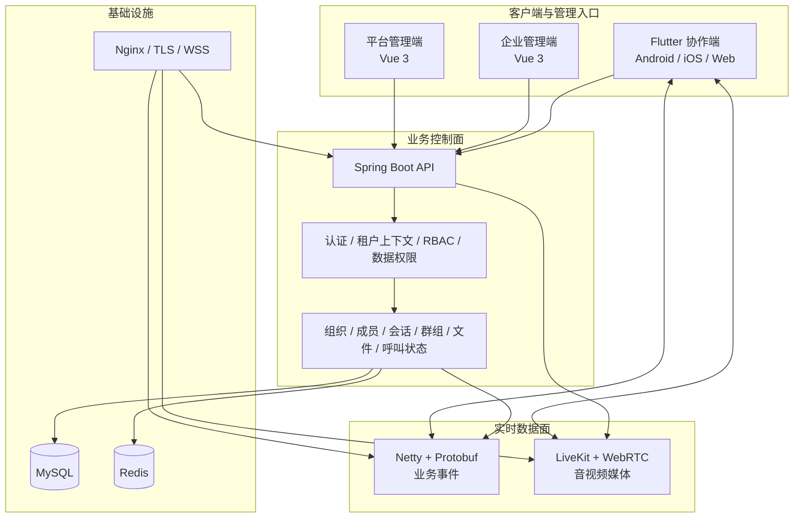
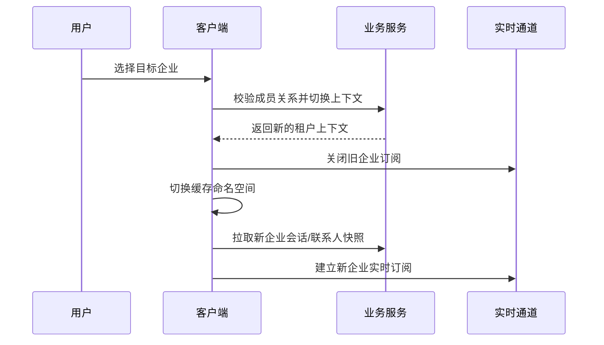
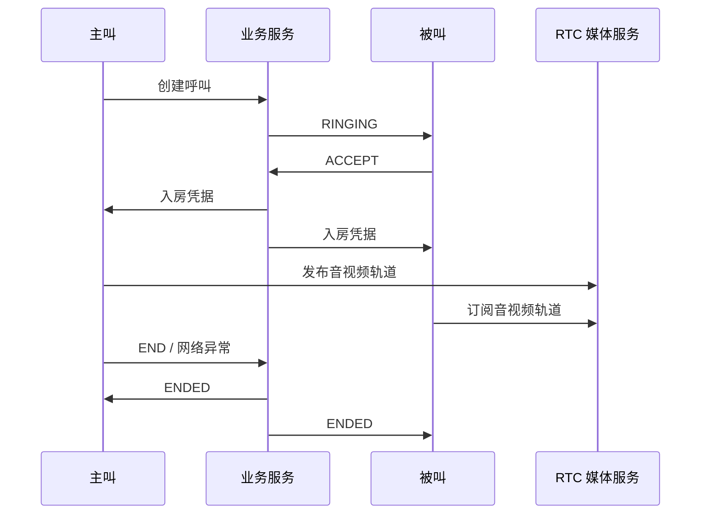
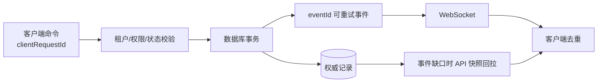
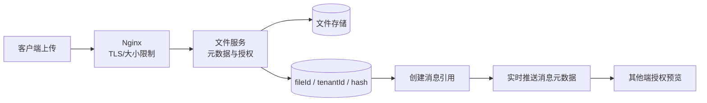
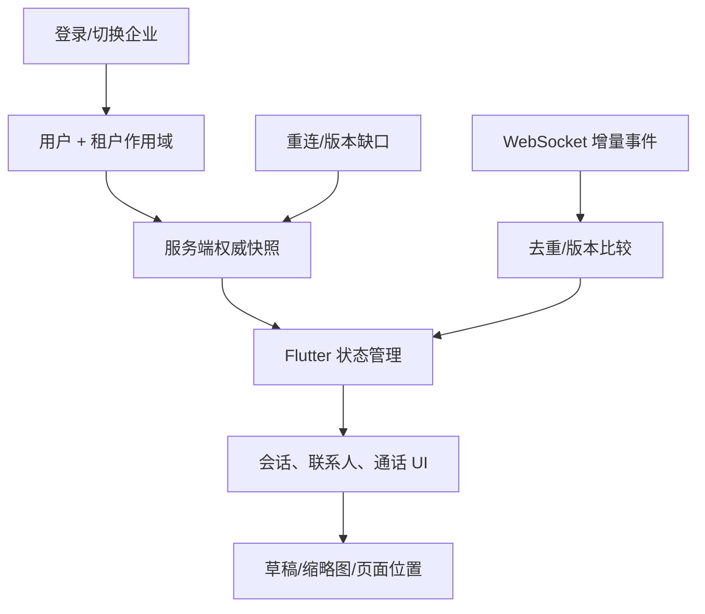

# 平台技术文章配图与架构图采集清单

这份清单与 `docs/marketing/articles/` 下的五篇文章配套使用。目标不是堆叠产品界面，而是让每一张图都回答一个技术问题：系统如何分层、状态如何流动、部署如何验证、故障如何定位。

所有公开截图都应先完成脱敏：遮蔽用户名、邮箱、手机号、企业名称、消息正文、文件名、Token、Cookie、服务器 IP、内网域名、数据库连接串、证书私钥和媒体服务密钥。

## 1. 一张必须先做的总架构图

现有主视觉：`docs/marketing/assets/enterprise-collaboration-architecture.png`，适合作为无文字封面背景。建议再制作一张带中文标签的横版架构图，供 CSDN、掘金、知乎和 B 站使用。

**绘图规范**：控制面、实时事件、媒体数据面使用三种稳定颜色；箭头标注协议，例如 HTTPS、WSS、WebRTC；不要把业务模块全部塞进图中；保持 16:9 横向比例，同时导出一张 3:4 竖版裁切图供小红书使用。

## 2. 建议采集的真实截图

| 编号 | 画面内容 | 推荐文章 | 要表达的技术点 | 采集方式 |
| --- | --- | --- | --- | --- |
| V1 | 平台端、企业端、Flutter 三端拼图 | 全部 | 三类入口共享一套身份和租户边界 | 浏览器与真机截图后统一拼图 |
| V2 | 企业切换前后会话列表 | CSDN、知乎、小红书 | 租户切换同步刷新数据域 | 使用测试账号并模糊名称 |
| V3 | WebSocket 事件帧或日志 | CSDN、掘金、B 站 | 事件 ID、类型、重连与去重 | DevTools/日志中仅保留字段名 |
| V4 | `callId` 通话状态日志时间线 | CSDN、知乎、B 站 | 业务状态与媒体连接可分层定位 | 导出后重绘为时序图更清晰 |
| V5 | Docker 容器与 Nginx 路由 | CSDN、掘金、B 站 | 应用容器与宿主机基础设施边界 | 截图前隐藏 IP、容器环境变量 |
| V6 | 云安全组或端口验收表 | 知乎、小红书、B 站 | HTTPS/WSS 与 UDP/TURN 是不同检查项 | 使用示意表优先于真实云账号截图 |
| V7 | Flutter Web 首次加载性能瀑布图 | 掘金、知乎 | 入口资源缓存与本地 CanvasKit 策略 | 隐藏请求参数与用户数据 |
| V8 | SQL 增量、菜单权限交付清单 | CSDN、掘金 | 功能发布包含代码、SQL、权限和验收 | 用 Markdown/表格重新绘制即可 |

## 3. 架构图之外，最值得做的三张技术图

### 3.1 租户切换时序图

### 3.2 通话状态与媒体链路图

### 3.3 发布验收流程图

### 3.4 事务提交与实时事件图

适合 CSDN、掘金、B 站加长段。它强调“业务状态先成为事实，实时事件负责尽快通知，重连端可回拉修复”。

### 3.5 文件上传与消息引用图

适合 CSDN、掘金、小红书、B 站。绘图时把“文件内容”和“会话消息”明确画成两条不同路径，避免观众误解为附件通过实时通道传输。

### 3.6 Flutter 多端状态恢复图

适合掘金、知乎和 B 站。图中要显式区分“本地体验缓存”和“服务端权威状态”，避免把客户端缓存误画成权限事实来源。

## 4. 发布到不同平台的图片策略

| 平台 | 图片数量 | 最佳比例 | 推荐内容 |
| --- | --- | --- | --- |
| CSDN | 3 到 5 张 | 16:9 或横版长图 | 总架构、时序图、部署验收表、日志关联图 |
| 掘金 | 3 到 6 张 | 横版图、代码截图 | 控制面/数据面图、重连时序、目录树、缓存策略 |
| 知乎 | 4 到 6 张 | 干净的横版信息图 | 技术决策图、租户切换、通话排查矩阵、域名边界 |
| B 站 | 6 到 8 个镜头 | 16:9 | 真实页面、架构图、终端、日志、部署拓扑 |
| 小红书 | 12 到 16 张 | 3:4 竖图 | 每页一个技术结论，少文字、强层级 |

## 5. 公开配图的底线

- 不展示生产数据库、Redis、服务器终端的完整连接信息。
- 不展示真实用户身份、客户企业、聊天内容、文件和音视频画面。
- 不在架构图中标注任何密钥、Token、私网网段或防火墙细节。
- 对日志使用“字段结构 + 脱敏值”的表达，优先重绘而非直接贴完整日志。
- 通过截图证明工程能力，但不把部署细节写成可被滥用的攻击入口。
