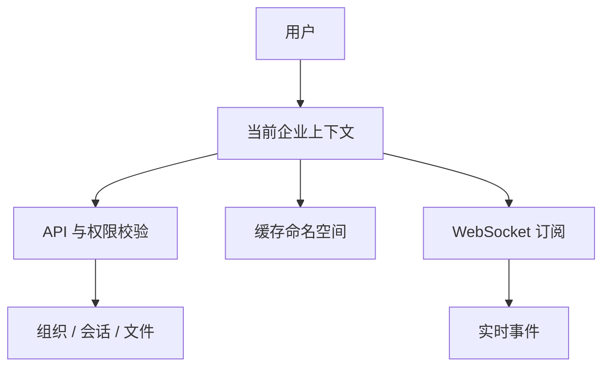
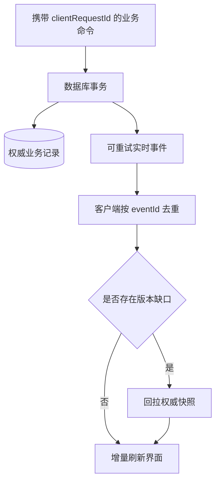
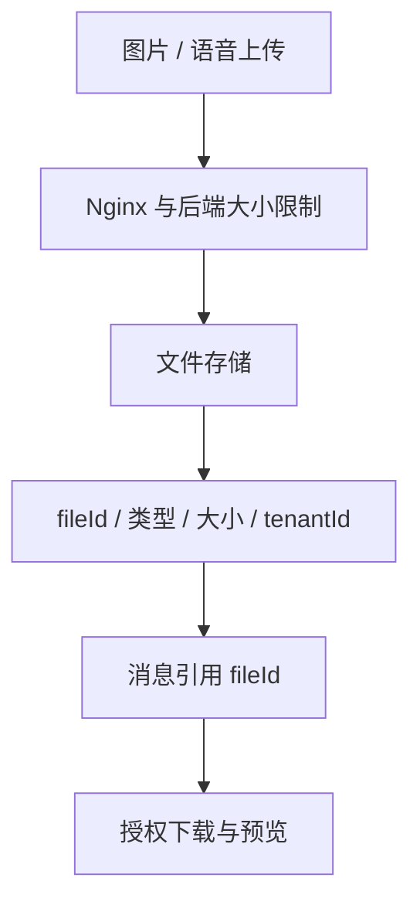
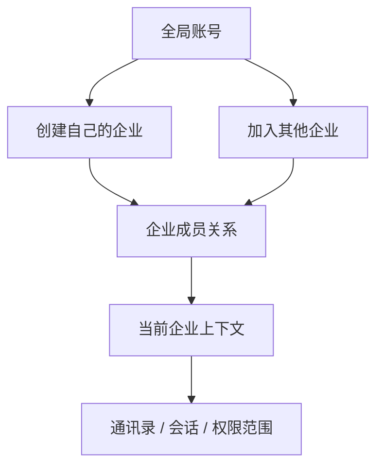
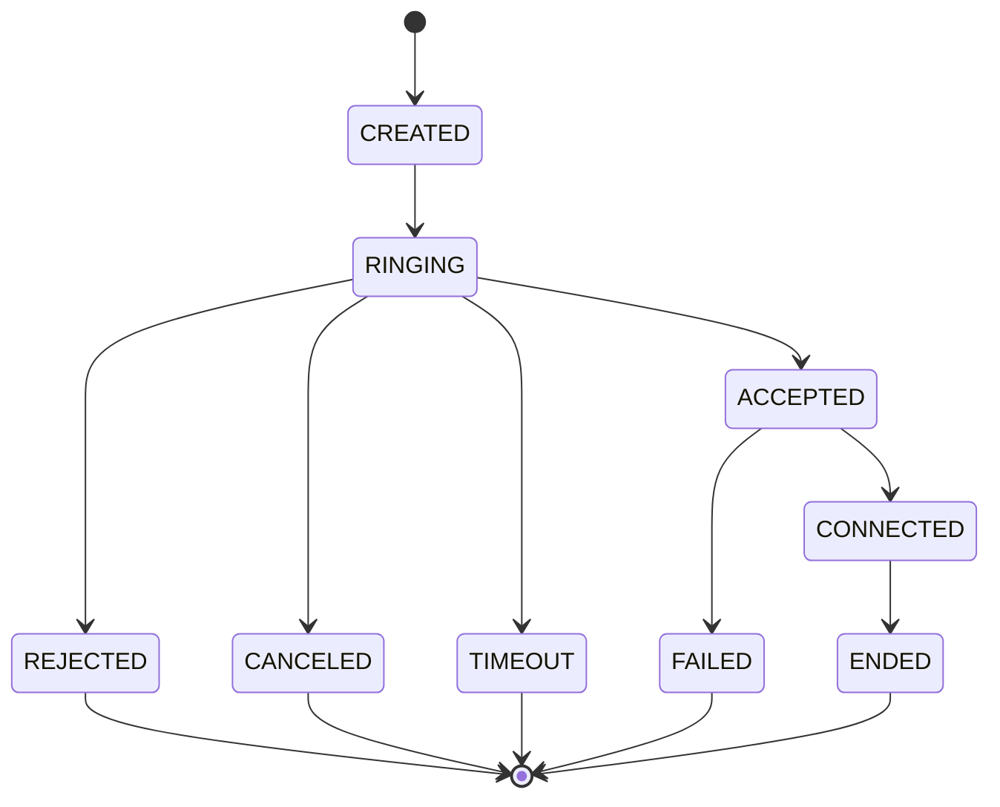

# 小红书技术图文稿：企业 IM 架构，不只是一条 WebSocket

> 平台：小红书  
> 推荐标题：做企业 IM 后才懂：难的不是聊天，是多租户、权限和音视频  
> 图文形式：10 张技术卡片 + 长文说明  
> 建议主视觉：`docs/marketing/assets/enterprise-collaboration-architecture.png`

## 封面文案

```text
企业 IM 不只是聊天
多租户 / 权限 / 实时消息 / 音视频
一套能部署的工程拆解
```

封面图片使用架构图的中心区域，标题使用高对比文字覆盖在留白处。不要放价格、促销或夸张承诺，保持技术内容的可信度。

> **贴图位 0（封面）**：预留一张 3:4 竖版主图。可先裁切 `docs/marketing/assets/enterprise-collaboration-architecture.png` 的中心区，后续替换为带“平台端 / 企业端 / Flutter / 实时 / 音视频”中文标签的竖版架构图。

## 可直接出图的技术图源

以下图源适合导出为 3:4 竖版信息图，再分别放到第 3、6、13、15 张卡片。每次只保留一个中心结论，文字不要比图更密。











上面两张图分别服务第 4 张和第 7 张：第一张解释“一个账号可加入多家企业”，第二张解释“响铃、接听、超时和挂断为什么必须由服务端收口”。导出时建议各自单独成图，不要把所有内容塞进同一张竖图。

## 图文卡片脚本

### 第 1 张：为什么企业 IM 比想象中复杂

**卡片标题**：能发消息，只是第一步

**卡片正文**：

```text
企业协作真正难的 4 件事：
1. 一个用户能切换多家企业
2. 权限与组织必须实时生效
3. 消息要有序、可重连、可补偿
4. 通话要穿透复杂网络
```

**设计建议**：四象限图，分别使用“组织、会话、连接、媒体”四个简洁图标。

**贴图位 1**：在四象限中央加一张小型的脱敏 Flutter 会话页截图，形成“真实界面 + 技术结构”的组合。

### 第 2 张：整体架构先分层

**卡片标题**：不要把所有能力塞进“聊天服务”

**卡片正文**：

```text
客户端：Vue 3 平台端 / Vue 3 企业端 / Flutter 多端
业务层：Spring Boot、租户、权限、组织、会话
实时层：Netty + Protobuf 业务事件
媒体层：LiveKit 音视频房间与媒体流
基础层：MySQL + Redis
```

**设计建议**：使用主视觉架构图，右下角加一句“小而清晰的职责边界，比大而全更重要”。

**贴图位 2**：架构图优先用横向比例，保留四周 10% 留白，便于平台裁切。可在图角添加一行小字：`控制面负责规则，数据面负责实时体验`。

### 第 3 张：多租户不是加个字段

**卡片标题**：`tenant_id` 只是开始

**卡片正文**：

```text
真正要隔离的是整条链路：
Token -> 当前企业上下文 -> 权限 -> SQL
Redis Key -> WebSocket Session -> 实时订阅

用户切换企业时，页面、缓存和连接作用域都要一起切。
```

**设计建议**：用箭头串联 Token、Tenant Context、SQL、Redis、WebSocket，突出“全链路”。

**加一行技术点**：`切换企业时，不只刷新页面，还要切换缓存命名空间与实时订阅。`

### 第 4 张：用户可以属于多家企业

**卡片标题**：账号与企业成员身份应该分开

**卡片正文**：

```text
User（全局账号）
  -> Membership（企业成员关系）
  -> Tenant Context（当前企业）

创建自己的企业，不等于不能加入其他企业。
切换企业，是切换当前上下文，不是换账号。
```

**设计建议**：一位用户连接三家企业的关系图，中间突出“当前企业”。

**贴图位 4**：放一张“企业切换弹窗”或 Flutter 设置页中的企业切换入口截图，企业名称和账号做模糊处理。

### 第 5 张：组织与会话是两种事实

**卡片标题**：员工调部门，不应丢失聊天记录

**卡片正文**：

```text
组织域：企业、部门、成员、角色
协作域：单聊、群聊、消息、已读、文件

组织变化影响通讯录；
群成员变化影响发言权；
两者不能互相替代。
```

**设计建议**：左右两列，左“组织树”，右“聊天气泡”，底部有一条“各自演进”的分隔线。

**补充文案**：`不要靠同步两张用户表解决组织变化；让成员关系成为协作权限的上游事实。`

### 第 6 张：实时消息和音视频为什么分开

**卡片标题**：消息不是媒体流

**卡片正文**：

```text
实时消息关心：鉴权、顺序、重连、离线补偿
音视频关心：低延迟、设备权限、UDP、TURN、NAT 穿透

业务服务保存通话状态，
媒体服务专注房间与音视频传输。
```

**设计建议**：左侧 WebSocket 事件流，右侧媒体轨道；中间画一条“业务状态”的控制线。

**贴图位 6**：可放一张左右对照图：左为事件字段 `eventId / eventType / occurredAt`，右为媒体连接流程 `权限 -> 信令 -> ICE/TURN -> 轨道`。

### 第 7 张：通话状态一定要有服务端收口

**卡片标题**：避免“对方挂了，我还在响”

**卡片正文**：

```text
created -> ringing -> accepted -> connected -> ended
                  -> rejected
                  -> timeout

超时、拒绝、取消、断线重连都必须幂等。
```

**设计建议**：状态机图，`ended` 用统一颜色突出。文案不要堆砌，给读者一个能直接迁移的模型。

**技术补充**：`ACCEPTED` 不等于媒体已连接。业务状态由服务端收口，媒体连接结果只是状态迁移的输入之一。`

### 第 8 张：本地启动的最小闭环

**卡片标题**：先跑通，再扩展

**卡片正文**：

```bash
mysql -u root -p < sql/mysql/1.0/shengyu-saas.sql
mvn clean install
cd shengyu-server && mvn spring-boot:run

cd shengyu-ui/shengyu-ui-admin-vue3 && pnpm install && pnpm front
cd shengyu-ui/shengyu-ui-admin-flutter && flutter pub get && flutter run
```

**设计建议**：深色终端卡片，命令分行清晰显示，不要缩得无法阅读。

**贴图位 8**：放一张本地容器运行成功的终端截图，敏感账号、数据库地址和环境变量必须隐藏。

### 第 9 张：生产环境最常见的误区

**卡片标题**：页面能打开，不等于通话部署完成

**卡片正文**：

```text
必须分别验证：
API HTTPS 是否可用
WebSocket WSS 是否 Upgrade 成功
Flutter Web 配置是否指向 API 域名
RTC DNS/证书是否正确
UDP / TURN / 媒体端口是否在安全组放行
```

**设计建议**：做成部署 Checklist，最后一项用醒目色强调“UDP/TURN”。

**技术补充**：`页面能打开只证明 HTTPS 正常；通话成功还需要 WSS、设备权限与媒体网络同时成立。`

### 第 10 张：工程结论

**卡片标题**：企业协作系统的可维护性，来自边界

**卡片正文**：

```text
租户负责访问边界
权限负责操作边界
会话负责协作状态
实时层负责事件传递
媒体层负责低延迟通信

每一层都有权威职责，问题才可以被定位、测试和演进。
```

**设计建议**：回到第一张的四象限结构，形成首尾闭环；页面底部保留开源地址二维码或仓库链接位置。

**贴图位 10**：放一张脱敏的日志关联图，展示 `requestId / tenantId / conversationId / callId` 如何把前后端问题串起来。

### 第 11 张：重连不是“重新连上”这么简单

**卡片标题**：事件要能去重，状态要能回拉

**卡片正文**：

```text
网络切换后，客户端可能收到重复事件或漏掉事件。

推荐字段：eventId / eventType / occurredAt
重连成功：优先补增量事件
发现缺口：再回拉会话、未读、成员快照
```

**设计建议**：画两条分支：`增量重放` 与 `回拉快照`，让读者一眼理解为什么“连接成功”不等于“数据已经正确”。

### 第 12 张：上线不是点一次 Docker

**卡片标题**：一次完整发布，至少验证 6 件事

**卡片正文**：

```text
容器健康
登录与租户切换
消息与重连
图片/语音上传
Flutter Web 首次打开与刷新
不同网络下的音视频接听与结束
```

**设计建议**：使用勾选清单布局。底部加一行：`代码、SQL、菜单权限、部署记录要作为同一交付单元。`

### 第 13 张：事件允许重复，业务不能重复

**卡片标题**：弱网点两次，不能发出两条消息

**卡片正文**：

```text
clientRequestId：防重复创建业务
eventId：防重复消费实时事件
eventVersion：发现乱序与缺口

事务先提交权威数据，
再投递可以安全重试的事件。
```

**设计建议**：用四步流程图表达：`点击发送 -> 数据库落库 -> 推送事件 -> 客户端去重`。画面尽量使用字段卡片，不贴真实业务日志。

### 第 14 张：图片和语音不要走消息大包

**卡片标题**：文件上传与聊天消息是两条链路

**卡片正文**：

```text
上传图片/语音
  -> 文件存储
  -> fileId + 类型 + 大小 + 租户归属
  -> 消息引用 fileId
  -> 其他设备按权限预览
```

**设计建议**：左侧画文件图标经过上传链路，右侧画聊天气泡只带 `fileId`。底部小字：`不要用 WebSocket 帧承载大附件。`

### 第 15 张：前端缓存不是服务端事实

**卡片标题**：本地快，是体验；服务端，才是边界

**卡片正文**：

```text
可本地优先：草稿、缩略图、列表位置
必须服务端确认：成员关系、权限、群状态、通话终态

切换企业 / 重连 / 版本缺口
=> 回拉权威快照
```

**设计建议**：天平图。左侧“体验缓存”，右侧“权威状态”；右侧略重，强调权限与成员关系不可只信本地。

### 第 16 张：让日志真正能定位问题

**卡片标题**：不要只写“请求失败”

**卡片正文**：

```text
同一次操作，关联这些字段：
requestId / tenantId / conversationId / callId / connectionId

面向用户：给明确的下一步
面向研发：给错误码与状态迁移证据
```

**设计建议**：做成两列卡片：左边“用户提示”，右边“内部错误码与关联 ID”。不要展示 Token、密码或消息正文。

## 发布长文

最近在整理一套企业协作系统时，我反复确认了一个事实：企业 IM 的难点不是“消息有没有发出去”，而是每一种状态到底由谁负责。

一个用户可以创建自己的企业，也可以加入其他企业。于是账号不应该等于企业成员，而应该拆成全局用户、企业成员关系和当前企业上下文。登录后每一次 HTTP 请求、每一个 Redis 缓存键、每一条 WebSocket 订阅都需要带上当前企业边界。只给数据库加一个 `tenant_id`，在用户切换企业后很容易留下旧缓存、旧订阅，最后变成串数据问题。

组织和会话也需要分开。部门、岗位、角色属于组织事实；单聊、群聊、已读、附件属于协作事实。员工调岗时，通讯录应该变；他参与过的项目群与历史消息不应该消失。群成员退出或被移除时，要阻止后续发言，但不能把这个人从企业通讯录直接“删除”。这类边界在刚开始开发时看似多余，后面做权限、审计、同步和多端缓存时会救命。

实时消息和音视频同样不建议混在一个服务里。消息侧主要处理鉴权、事件顺序、重连和离线补偿；音视频侧关注设备权限、低延迟、UDP、TURN 和复杂网络。业务服务保存通话创建、响铃、接听、结束的权威状态；媒体服务处理房间和音视频轨道。这样当出现“接听后一直转圈”的问题时，就可以顺着 `callId` 分层检查：业务令牌是否签发、浏览器是否拿到麦克风权限、WSS 是否连上、UDP/TURN 是否放行、房间是否被提前关闭。

部署时也有个很现实的提醒：网页可以打开，不等于实时能力就正常。API、页面、WebSocket、音视频服务最好有清晰域名边界；Nginx 要正确处理 WebSocket Upgrade；上传大小限制要在反向代理和后端同步；LiveKit 一类的媒体服务除了 HTTPS，还需要按实际配置开放 UDP 与 TURN 端口。

我后来把部署验收也拆成了几个独立问题：静态页面是不是加载了当前版本，登录和切换企业是否拿到正确数据，WebSocket 是否完成 Upgrade 并能在断网后恢复，图片和语音文件是否跨过了反向代理与后端大小限制，真机和浏览器是否都能在不同网络下建立和结束通话。这样做会比“感觉服务可用了”多一点步骤，但线上问题发生时，能非常快地知道它属于前端缓存、业务服务、实时连接还是媒体网络。

再往前一步，建议把每项变更作为完整交付单元：功能代码、数据库增量 SQL、菜单和按钮权限、默认角色、环境变量、验收结果都放在一起。企业系统的功能经常不是少一个页面那么简单，少一条权限 SQL 就可能变成管理员看不到菜单；少一次缓存失效就可能在切换企业后看到旧数据。把这些关系写清楚，是让系统能持续演进的基础。

另一个容易被忽略的细节是实时事件的可靠性。网络切换时，重复推送并不可怕，真正可怕的是重复推送把业务状态重复创建，或者少了一条事件以后客户端继续靠旧数据猜测。比较实用的做法是：客户端发送命令时带 `clientRequestId`，服务端用它防止重复创建；实时事件带 `eventId` 供客户端去重；事件版本出现缺口时，通过 API 回拉当前租户的会话、未读和成员快照。这样并不需要承诺“网络永远不丢包”，却可以保证客户端最终回到正确状态。

文件能力也一样。图片、语音、附件应该先完成上传和元数据登记，再由聊天消息引用 `fileId`。好处是 WebSocket 不会被大二进制包阻塞，预览和下载仍能按企业权限检查，排查真机上传异常时也能明确分到移动网络、证书、反向代理大小限制、后端上传配置或文件存储中的某一层。

> **贴图位 12（长文补图）**：可用一张“命令幂等 + 事件去重 + 快照回拉”的三段流程图，配合第 13、15 张形成完整阅读闭环。

> **贴图位 11（长文配图）**：建议在这一段后放一张“发布验收 Checklist”截图，或者一张已脱敏的容器、Nginx、实时连接健康状态拼图。

我把这套系统的代码、SQL、部署说明都放在公开仓库里。对我来说，它不是一个“功能清单”，更像一份持续打磨的工程实践：把租户、权限、协作状态、实时事件和媒体网络各放到正确的位置，系统才有机会在多端和复杂网络下稳定演进。

## 推荐话题

`#程序员` `#后端开发` `#Flutter` `#SpringBoot` `#Vue3` `#WebSocket` `#企业IM` `#系统设计` `#Docker部署` `#音视频`

## 开源地址

- Gitee：[https://gitee.com/jinzheyi/yubb-saas-pro](https://gitee.com/jinzheyi/yubb-saas-pro)
- GitHub：[https://github.com/jinzheyi/yubb-saas-pro](https://github.com/jinzheyi/yubb-saas-pro)
