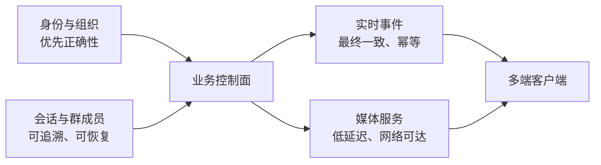
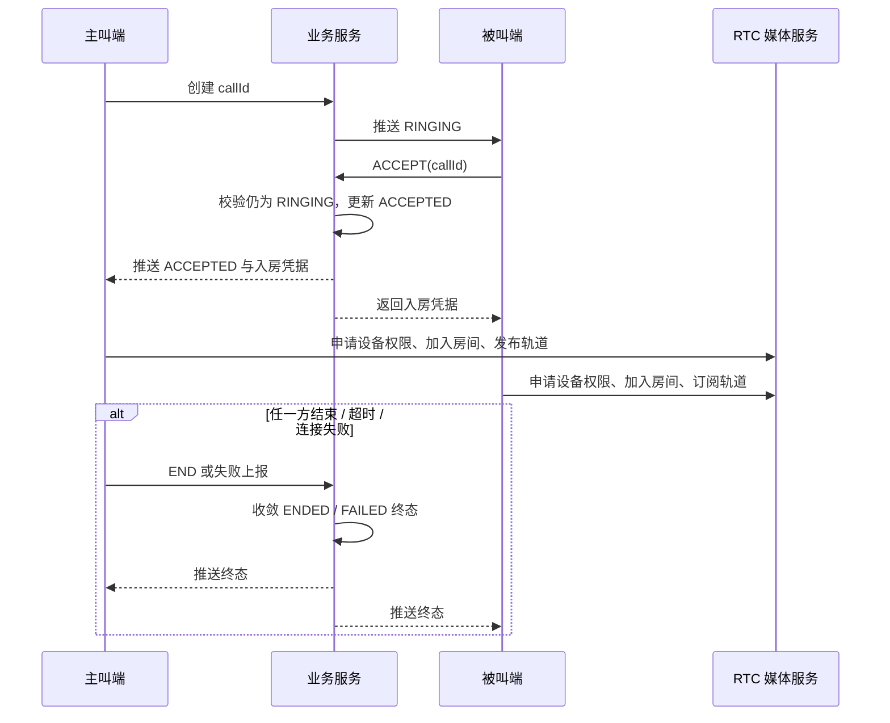
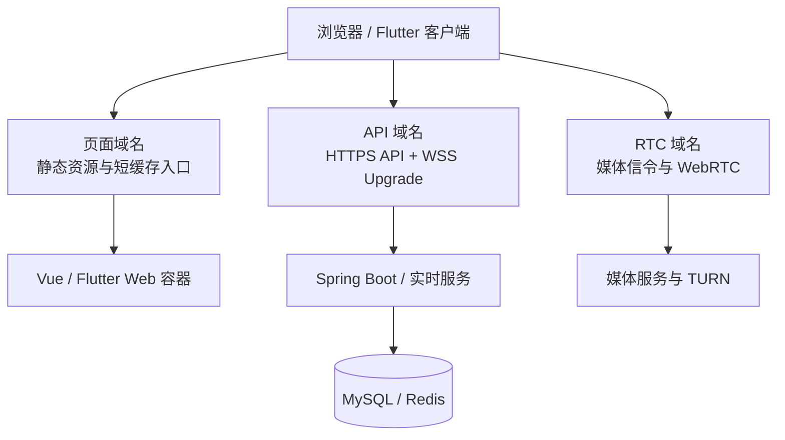
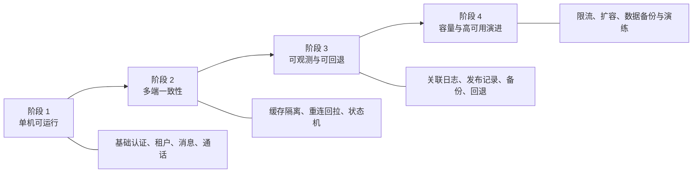

# 企业协作系统的技术决策：为什么把多租户、权限、实时消息和音视频拆开设计

> 平台：知乎  
> 建议标题：企业协作系统如何做技术选型？从多租户、权限到实时通信的一套分层方法  
> 建议配图：`docs/marketing/assets/enterprise-collaboration-architecture.png`

做企业协作系统时，最容易被低估的一件事是：它不是“聊天功能加一个后台”。

真正决定系统能否进入企业场景的，往往不是消息列表能否展示，而是下面这些问题能否持续保持一致：用户此刻属于哪个企业、这条消息能否被他看到、他切换组织后还能不能收到旧组织的实时事件、通话媒体是否可以穿透复杂网络、以及运维时如何把问题定位到正确的层。

本文以一个 Spring Boot、Vue 3 与 Flutter 组成的企业协作系统为例，整理一套可复用的技术决策方法。重点不是某个框架的“最佳实践”，而是如何划清系统边界，避免把原本独立的复杂问题搅在一起。


> **配图位 A（建议放在这里）**：一张三层系统边界图。上层写“平台管理、企业管理、员工协作”，中层写“业务控制面”，下层写“实时事件与媒体数据面”。图中不要出现服务器 IP、密钥或真实账号。

## 一、先拆问题：企业协作不是一个服务，而是四类一致性问题

从用户视角看，系统通常只有“登录、通讯录、聊天、通话、后台管理”。从工程角度看，它至少包含四类需要分别治理的问题。

| 问题域 | 典型对象 | 一致性要求 | 失败后的用户感受 |
| --- | --- | --- | --- |
| 身份与组织 | 用户、企业、部门、岗位、角色 | 强一致或接近强一致 | 能登录但看错企业、权限错乱 |
| 业务协作 | 会话、群成员、消息、已读、文件 | 可追溯、有序、可恢复 | 会话不存在、重复消息、成员状态异常 |
| 实时连接 | WebSocket 连接、在线状态、事件投递 | 最终一致、幂等、可重连 | 在线却收不到消息、切租户后收到旧消息 |
| 音视频媒体 | 房间、令牌、ICE、TURN、媒体流 | 时效性优先、网络可达 | 能呼叫但接通失败、接听后一直转圈 |

将四类问题放在同一个“聊天服务”里，初期代码看起来会很快，后续却很难排错。较好的做法是保持责任边界：业务服务维护权威状态，实时通道负责事件传递，媒体服务负责音视频数据面。

这背后其实是对一致性成本的选择。组织成员、角色与资源权限一旦错误，造成的是越权，必须优先保证正确性；消息事件偶尔重复到达，可以通过幂等处理恢复；媒体在弱网下瞬时抖动，更需要快速降级和网络补偿。把不同一致性目标分层，才不会为了“所有地方都绝对一致”牺牲实时体验，也不会为了低延迟放弃权限边界。



## 二、关键决策一：租户上下文必须先于业务对象存在

多租户系统中，用户不是简单地“属于一个租户”。更符合企业真实场景的模型是：一个全局用户拥有一个或多个企业成员身份，在每次会话中有一个当前企业上下文。

可以将概念拆成三层：

```text
全局用户 User
  └─ 企业成员关系 Membership
       └─ 当前租户上下文 Tenant Context
            ├─ 部门 / 岗位
            ├─ 角色 / 数据权限
            └─ 会话、联系人、消息、文件等业务访问范围
```

这样设计有三个直接收益：

1. 用户可创建自己的企业，也可加入多家企业，不需要复制账号。
2. 切换企业是切换上下文，而非重新注册或替换个人资料。
3. 每一个请求、每一条实时事件都能明确落在某个企业边界中。

### 租户上下文要贯穿 HTTP、缓存、文件和连接

租户模型落地时，不要只检查业务查询。一个企业协作系统至少有四条容易被遗漏的旁路：

| 旁路 | 容易发生的问题 | 建议约束 |
| --- | --- | --- |
| Redis 缓存 | 切换企业后读到旧未读数或会话 | key 使用 `tenantId + userId` 作用域 |
| WebSocket | 已切企业但仍订阅旧企业事件 | 鉴权绑定租户，切换时重建订阅 |
| 文件访问 | 猜测文件 ID 后跨企业下载 | 文件元数据回溯所属企业并二次校验 |
| 后台任务 | 异步任务忽略当前企业上下文 | 任务载荷显式携带 tenantId，执行时校验 |

一个推荐的“切换企业”顺序是：服务端确认成员关系有效，签发或刷新当前企业上下文；客户端停止旧实时订阅，切换本地数据命名空间；拉取新企业快照；最后建立新订阅。顺序不可颠倒，否则短暂的旧订阅可能把不属于当前企业的事件写入新页面。

> **配图位 B（建议放在这里）**：建议展示一次“切换企业前后”的会话列表和 WebSocket 连接状态对比。图注：`切换企业是安全上下文、缓存与连接作用域的同步切换`。

服务端应将租户解析放在认证之后、业务执行之前。HTTP 请求从 Token、请求头或服务端会话中解析当前租户；WebSocket 连接在认证阶段绑定用户和租户，并在切换租户时明确更新订阅关系。查询条件、缓存键、文件访问校验、消息投递都不能只依据 `userId`。

一个常见的错误是：数据库表增加了 `tenant_id`，但 Redis key、WebSocket session、文件预览地址仍然是全局的。这样在单租户测试中一切正常，一旦同一用户切换企业，就会暴露串数据问题。工程上应把“租户作用域”视为基础设施能力，而不是某几张表的字段。

## 三、关键决策二：通讯录与会话的权威状态要分开

通讯录是组织事实，会话是协作事实。两者都与用户有关，但更新节奏和约束不同。

```text
组织域
企业 -> 部门树 -> 成员 -> 岗位 / 角色

协作域
单聊 / 群聊 -> 成员快照 -> 消息 -> 已读 / 撤回 / 文件
```

例如，某人从部门 A 调至部门 B，通讯录应该立即变化；但他过去参与的会话、历史消息不应因此丢失。相反，用户退出某个群后，群成员关系应影响后续发言权，却不应该抹掉组织中的员工身份。

因此，业务表与接口应遵守以下原则：

- 建群时校验最少成员数，避免创建没有实际协作价值的群；
- 发消息前以群成员关系作为最终判定，而不是只信任客户端传来的会话 ID；
- 用户被移出群、主动退群、群解散分别使用不同状态和事件；
- 列表查询可用缓存加速，但发言、入群、退群等写操作必须回到权威数据校验；
- 所有状态变化产生可幂等消费的实时事件，客户端重复收到也不能破坏本地状态。

### 用领域事件连接组织变化与协作变化

组织域与协作域不直接复制数据，并不等于两者没有联系。较好的方式是由服务端在成员状态变化后产生领域事件，例如 `MEMBERSHIP_DISABLED`、`MEMBERSHIP_TRANSFERRED`、`GROUP_MEMBER_REMOVED`。协作侧消费事件后更新可见范围、会话成员标记和实时订阅，但历史消息是否可见、是否保留头像快照等规则仍由业务模型决定。

这样做避免了“定时同步两张用户表”的脆弱方案，也让组织调整具备可测试的输入和输出：给定某个成员状态变化，哪些会话会失效、哪些设备应收到通知、哪些缓存需要清理，都可以通过事件处理进行验证。

这也是“会话不存在”“已经退群但仍可发言”这类问题的根因常在服务端状态，而不只在 Flutter 页面上的原因。

## 四、关键决策三：消息面与媒体面不要混用

企业 IM 的实时消息和音视频通话虽然都需要长连接，但数据特性不同。

消息系统更在意：鉴权、顺序、重试、离线补偿、已读回执和多端同步。音视频更在意：低延迟、NAT 穿透、UDP 连通性、TURN 中继和浏览器设备权限。

推荐的职责划分如下：

| 层级 | 负责什么 | 不负责什么 |
| --- | --- | --- |
| Spring Boot 业务服务 | 登录、租户、成员、会话权威状态、通话邀请与结束状态 | 转发媒体流 |
| Netty + Protobuf 实时通道 | 业务事件、在线连接、消息投递、状态通知 | 音视频编解码与媒体中继 |
| LiveKit | 房间、媒体协商、音视频流、客户端媒体连接 | 企业权限模型、业务审计规则 |
| TURN / 网络设施 | 复杂网络下的媒体转发与可达性 | 业务身份和业务状态 |

通话状态可以抽象成有限状态机：

```text
created -> ringing -> accepted -> connected -> ended
                 \-> rejected
                 \-> timeout
```

这里有两个很重要的工程细节。

第一，状态机的权威端在业务服务。媒体房间关闭并不自动等同于“业务通话已结束”，业务服务需要以唯一的通话记录、超时任务和幂等结束接口统一收口。否则会出现呼叫方已自动挂断、被叫方仍在响铃的分裂状态。

第二，浏览器端必须在用户点击“接听”或“发起”这类手势触发的调用栈内申请麦克风/摄像头权限。浏览器的权限策略不能被服务端日志替代；移动端、Flutter Web、原生端应共享业务流程，但采用各自的设备权限适配。

### 通话失败的分层排查矩阵

通话问题经常被描述为“对方接听后没反应”。这句话信息量很少，但按照层次可以快速缩小范围：

| 层次 | 首先检查什么 | 常见症状 |
| --- | --- | --- |
| 业务状态 | 呼叫是否存在、状态是否允许接听、令牌是否签发 | 点击接听立即结束或提示业务错误 |
| 客户端权限 | 浏览器/系统是否真的弹出并授予麦克风摄像头 | 无权限、未触发浏览器授权提示 |
| 信令连接 | HTTPS/WSS 证书、反向代理 Upgrade、房间地址 | 页面正常但无法加入房间 |
| 媒体网络 | UDP、TURN、DNS、客户端到媒体服务的路由 | 可响铃，接听后长时间转圈 |
| 状态收口 | 超时、取消、拒绝是否广播给所有设备 | 一端已挂断，另一端持续响铃 |

这张矩阵比“重启容器试试”更有用。排查时使用同一个 `callId` 串联 API、实时通道和媒体日志；一旦能把问题落到其中一层，修复就不会误伤其他端的正常链路。

> **配图位 C（建议放在这里）**：放一张脱敏后的浏览器权限提示与服务器 `callId` 日志并排截图，展示“设备权限”和“服务端通话状态”是两条独立但关联的证据链。

### 用两条并行链路理解一次通话

通话的控制链路与媒体链路会在“接听”之后同时开始。前者负责状态合法性和多端同步，后者负责设备、网络和音视频轨道。把它们画成一张图，能够避免“媒体服务能连上，就跳过业务状态”的设计误区。



此图还可以作为通话验收用例的骨架：每一个箭头都应有至少一个正常用例和一个失败用例，例如被叫拒绝、主叫取消、权限拒绝、房间令牌过期、UDP 不可达和断网重连。

> **配图位 C-1（建议放在这里）**：将该图导出为双色时序图，控制链路用一种颜色、媒体链路用另一种颜色，适合知乎读者快速理解系统边界。

## 五、关键决策四：用“可观测链路”替代猜测式排障

实时系统的问题经常跨越客户端、Nginx、业务服务、媒体服务与云安全组。没有统一的观测字段，排障就会退化成不断重启。

每一条关键请求建议至少携带：

```text
requestId / userId / tenantId / conversationId / callId / connectionId
```

不同层记录同一组关联字段：

- API 日志记录认证结果、租户解析结果、业务状态变更；
- WebSocket 日志记录连接建立、断开、重连、租户切换和事件投递；
- LiveKit 记录房间、参与者、令牌、连接失败原因；
- Nginx 记录请求状态、反向代理目标、升级 WebSocket 是否成功；
- Flutter 在 Release 环境保留经过脱敏的网络错误码和可重试信息。

### 设计日志字段时，先让它能回答问题

日志不是为了记录“某方法被调用了”，而是为了在故障发生后回答：谁、在哪个企业、操作了哪个会话或通话、走到哪个阶段、最终为什么失败。一个合格的关键日志应具备关联 ID、状态迁移前后值、错误分类和耗时；而不是把请求体、Token 或完整消息内容直接打出来。

```text
callId=... tenantId=... caller=... callee=...
from=RINGING to=ACCEPTED durationMs=18 result=SUCCESS
```

同样的字段可以进入 API 日志、WebSocket 事件日志与媒体服务旁路日志。日志格式稳定后，后续接入检索、告警和仪表盘都不需要重新理解业务语义。

这样，当用户报告“接听后转圈”时，可以按 `callId` 快速判断问题发生在：业务端是否签发令牌、浏览器是否得到媒体权限、WSS 是否可达、UDP/TURN 是否可达，还是房间已被提前关闭。

## 六、代码架构如何组织，才能让变化落在正确位置

一个适合持续演进的工程目录，不需要追求花哨，关键是让依赖方向清楚：

```text
shengyu-server/                         # Spring Boot 启动与运行配置
shengyu-module-*/                       # 领域模块：系统、租户、协作等
shengyu-ui/
  shengyu-ui-platform-vue3/             # 平台运营侧：租户、套餐、全局配置
  shengyu-ui-admin-vue3/                # 企业管理侧：组织、成员、权限、业务
  shengyu-ui-admin-flutter/             # 用户侧：移动端与 Web 端
deploy/
  aliyun/                               # 生产容器编排与 Nginx 部署资料
  livekit/                              # 音视频媒体服务配置与网络验证脚本
sql/                                    # 初始化与增量升级 SQL
docs/                                   # 架构、部署与运维说明
```

这里的约束是：平台侧不直接承载员工协作页面；客户端不绕过服务端直接写业务数据；实时通道不成为业务规则的唯一来源；媒体层不保存企业权限真相。

## 七、从本地到生产：部署过程应当可重复，而不是靠记忆

本地开发先启动数据库和缓存，再启动后端、两套 Vue 前端与 Flutter 客户端。典型命令如下：

```bash
# 初始化数据库
mysql -u root -p < sql/mysql/1.0/shengyu-saas.sql

# 编译并启动后端
mvn clean install
cd shengyu-server
mvn spring-boot:run

# 启动企业管理端
cd shengyu-ui/shengyu-ui-admin-vue3
pnpm install
pnpm front

# 启动平台管理端
cd ../shengyu-ui-platform-vue3
pnpm install
pnpm front

# 启动 Flutter 客户端
cd ../shengyu-ui-admin-flutter
flutter pub get
flutter run
```

如需快速拉起本地容器依赖，可使用项目提供的 Compose 配置：

```bash
cd deploy/local-docker
docker compose --env-file docker.local.env -f docker-compose.local.yml up -d
```

生产部署要把 MySQL、Redis 与应用容器的职责分清。已经以宿主机方式稳定运行的 MySQL/Redis 不需要为了“全容器化”而重复部署一套。应用服务、两个 Vue 前端、Flutter Web、预览服务和 LiveKit 则可由 Compose 统一管理。

### Nginx 与域名边界也属于架构的一部分

生产环境建议明确区分页域名、API 域名和媒体域名。页面只负责加载静态资源；API 域名处理 HTTPS API 与 WSS 升级；媒体域名由 RTC 服务承担信令和媒体相关访问。这种分法不仅便于证书、缓存和限流策略独立配置，也避免前端环境变量把“页面地址”误当成“接口地址”。

对于上传能力，反向代理的 `client_max_body_size`、Spring Boot 的 multipart 上限、文件存储权限和预览服务都要一起验收。对于 Flutter Web，入口 HTML 与启动脚本应采用较短缓存或协商缓存，版本化的静态资源再使用长缓存；否则前端发布后会出现入口引用新旧资源不一致的偶发故障。

> **配图位 D（建议放在这里）**：放一张域名路由图：页面域名 -> 静态站点，API 域名 -> API/WSS，RTC 域名 -> 媒体服务。公开内容请使用示例域名而非真实内网地址。



这个拓扑的专业价值在于，缓存策略、证书配置、限流、日志和故障域都可分开治理。页面发布异常不会直接改变 API；媒体网络问题也不会被静态资源缓存掩盖。对外展示时使用角色名称或示例域名，真实生产 IP、内网端口和密钥不应进入图中。

```bash
cd /opt/shengyu/saas-deploy
docker compose --env-file docker.prod.env \
  -f docker-compose.yml \
  -f docker-compose.prod-host.yml \
  up -d --build server admin-vue3 platform-vue3 im-flutter-web kkfileview
```

Flutter Web 的构建参数必须使用真实 API 与 WebSocket 域名，不能把页面域名当成接口域名：

```bash
cd shengyu-ui/shengyu-ui-admin-flutter
flutter pub get
flutter build web --release \
  --dart-define=API_BASE_URL=https://apisaas.shengyukj.top/app-api \
  --dart-define=SOCKET_URL=wss://apisaas.shengyukj.top/ws \
  --dart-define=NETWORK_PROBE_URL=https://apisaas.shengyukj.top/app-api \
  --dart-define=NETWORK_PROBE_HOST=apisaas.shengyukj.top
```

对应的 Nginx 要正确转发 HTTP API、WebSocket Upgrade 和 LiveKit 信令；上传场景还需统一设置足够的 `client_max_body_size`，后端 multipart 限制也要同步。音视频生产环境除了 TCP 443，还必须按 LiveKit/TURN 实际端口开放 TCP/UDP 安全组，浏览器页面能打开不代表媒体数据面已经可达。

## 八、可复用的检查清单

当系统从演示走向真实企业使用，以下检查比“功能能点通”更重要：

- 同一用户切换企业后，通讯录、会话列表、缓存和 WebSocket 订阅是否全部切换；
- 用户被邀请加入企业后，是否需要通过切换企业确认激活成员上下文；
- 加入申请被拒绝后，是否允许在合理冷却期后再次申请；
- 退出群、被移出群、群解散、通话超时是否都有唯一的服务端收口；
- Flutter Web 首次打开是否避免强缓存入口脚本、是否能在弱网下给出明确网络状态；
- 文件上传的反向代理、后端大小限制、对象/本地存储权限是否一致；
- LiveKit URL 是否为 `wss://`，证书、DNS、UDP/TURN 端口是否在公网真实验证过；
- SQL 升级是否可重复执行，菜单、权限、字典与数据迁移是否同时交付。

企业协作系统的难点从来不是“功能数量”，而是不同状态在不同端、不同网络条件下仍然能被正确解释。把租户、权限、业务状态、实时事件和媒体网络各自放在正确位置，复杂度才会从不可控的偶然问题，变成可以测试、观测和演进的工程系统。

## 九、技术选型不要问“哪个最好”，而要问“哪个边界最清楚”

企业协作系统常见的技术讨论，容易停留在“用 WebSocket 还是 MQ”“用某个聊天云服务还是自建”“数据库要不要分库”等孤立问题。更值得先回答的是：这个组件是否会替你接管本不该让它接管的业务边界。

以下表格不是唯一答案，而是一份判断框架：

| 决策点 | 优先判断的问题 | 本项目中的职责取舍 | 不建议的做法 |
| --- | --- | --- | --- |
| 实时协议 | 是否需要可控的业务事件模型与多端兼容 | Netty + Protobuf 承载业务事件 | 将所有业务语义塞进无版本 JSON 字符串 |
| 音视频 | 是否需要低延迟、设备能力与复杂网络适配 | LiveKit 负责房间和媒体，业务服务负责呼叫状态 | 把媒体连接结果直接当作业务最终状态 |
| 租户 | 用户是否可能加入多个企业 | 账号、成员关系、当前租户上下文分层 | 把 tenantId 仅作为 UI 选择项 |
| 缓存 | 缓存是否可能绕过权限 | 以用户与租户为作用域，状态缺口回拉快照 | 用全局会话缓存混合多企业数据 |
| 文件 | 二进制是否会拖慢实时通道 | 文件独立传输，消息引用元数据 | 用 WebSocket 长帧传大文件 |
| 部署 | 现有基础设施是否已稳定 | 保留宿主机 MySQL/Redis，应用服务容器化 | 为追求形式统一重复部署数据服务 |

### 一个可评审的架构决策记录格式

对外协作或团队扩展时，建议把重要技术决策写成简短 ADR（Architecture Decision Record），而不是只留在聊天记录里：

```text
决策：业务状态与媒体传输分离
背景：通话需要同时处理权限、超时、网络穿透和多端同步
选择：业务服务保存权威状态；RTC 服务只处理媒体房间与轨道
后果：需要维护 callId 和状态机，但可独立定位媒体与业务故障
验证：不同网络、双端接听、超时、取消、重连的验收用例
```

这类记录不长，但能让未来维护者知道“为什么这样做”，避免系统随着需求迭代重新退回到把所有复杂性耦合在一起的状态。

> **配图位 E（建议放在这里）**：将上表绘制成“选型判断矩阵”信息图，横轴为业务控制权，纵轴为实时性/网络复杂度；在四个象限标注 API、事件、媒体、存储。

## 十、从单机可用到企业级可运维：需要补齐哪些能力

企业级不等于一开始就部署大量组件，而是每个关键故障都有明确的发现与恢复路径。可以按成熟度逐步建设：



当前阶段最有性价比的动作往往不是先上更多中间件，而是先把版本、环境变量、SQL、菜单权限、部署步骤与验收结果写成可重复执行的记录。之后再根据真实用户量、消息量、文件量和通话并发选择缓存优化、异步化、分库或节点扩容。

### 先定义错误分类，再做用户提示

用户看到“系统异常”时，研发很难定位，用户也不知道是否应该重试。接口和客户端可以把错误粗分为：认证/权限、参数/状态冲突、网络、文件、实时连接、媒体设备、媒体网络、服务端内部异常。对外提示保持简洁，对内保留明确错误码与关联 ID。

```text
用户提示：当前通话已结束，请返回会话后重新发起。
内部记录：CALL_STATE_CONFLICT, callId=..., expected=RINGING, actual=ENDED
```

这种分层既避免把内部堆栈暴露给用户，也让前端能够针对网络问题提供重试、针对状态冲突主动刷新、针对权限问题引导用户检查授权。

> **配图位 F（建议放在这里）**：放一张“用户提示 - 错误码 - 排查层级”的三列表，突出面向用户的语言与面向运维的证据不同。

## 开源地址

- Gitee：[https://gitee.com/jinzheyi/yubb-saas-pro](https://gitee.com/jinzheyi/yubb-saas-pro)
- GitHub：[https://github.com/jinzheyi/yubb-saas-pro](https://github.com/jinzheyi/yubb-saas-pro)
